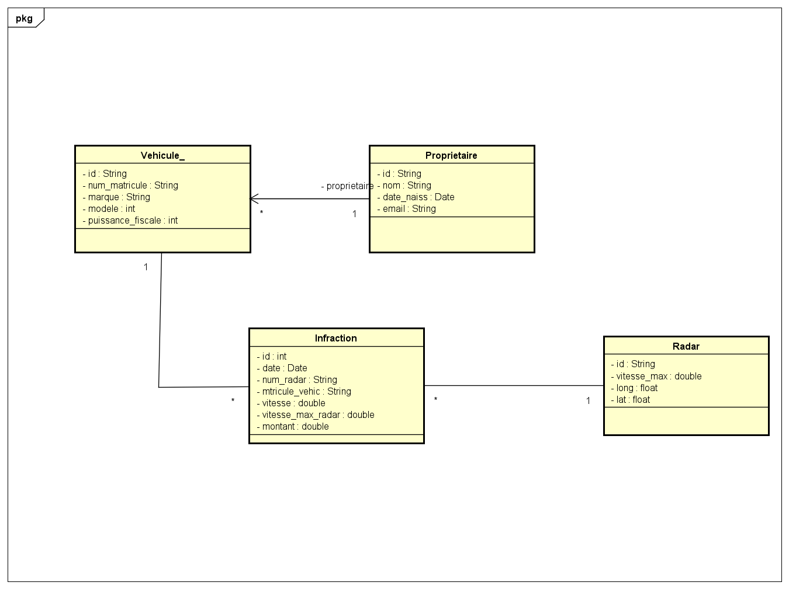
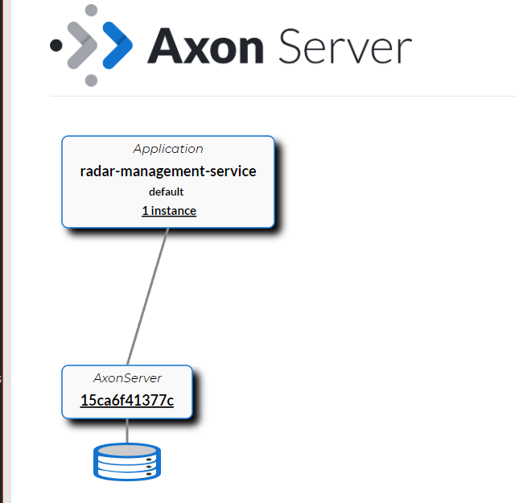
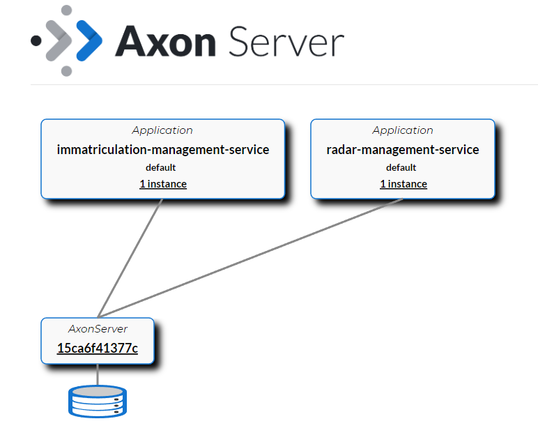
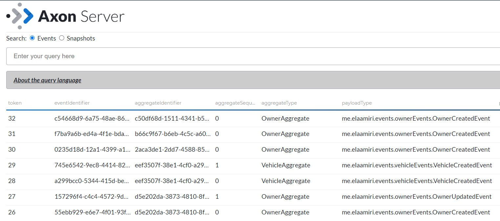
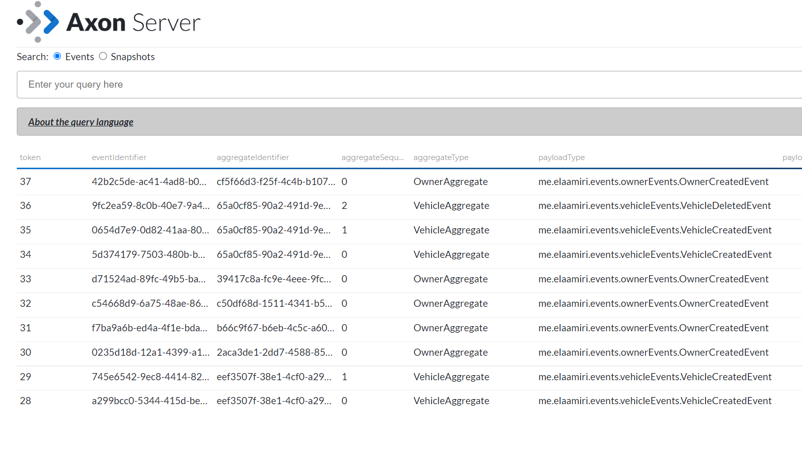
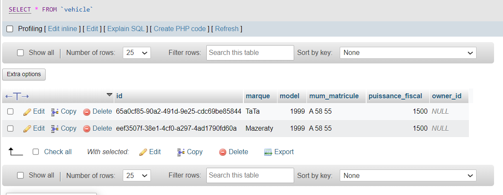
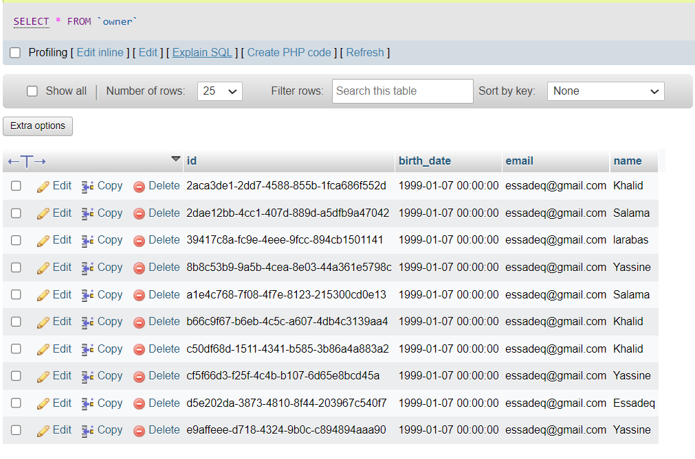

<!-- vscode-markdown-toc -->
* 1. [Project Description](#ProjectDescription)
* 2. [Etablir une architecture technique du projet](#Etablirunearchitecturetechniqueduprojet)
* 3. [Etablir un diagramme de classe global du projet](#Etablirundiagrammedeclasseglobalduprojet)
* 4. [Développer le micro-service Radar](#Dvelopperlemicro-serviceRadar)
	* 4.1. [Poperties](#Poperties)
	* 4.2. [Command module](#Commandmodule)
		* 4.2.1. [Commands](#Commands)
		* 4.2.2. [Events](#Events)
		* 4.2.3. [Dtos](#Dtos)
		* 4.2.4. [Aggregate](#Aggregate)
		* 4.2.5. [Command Controller](#CommandController)
		* 4.2.6. [Tests](#Tests)
	* 4.3. [Query module](#Querymodule)
		* 4.3.1. [Entities](#Entities)
		* 4.3.2. [Repositories](#Repositories)
		* 4.3.3. [Queries](#Queries)
		* 4.3.4. [Services and Queryhandlers](#ServicesandQueryhandlers)
		* 4.3.5. [Query Controller](#QueryController)
		* 4.3.6. [Test](#Test)
* 5. [Développer le micro-service Immatriculation](#Dvelopperlemicro-serviceImmatriculation)
	* 5.1. [Command module](#Commandmodule-1)
		* 5.1.1. [Commands](#Commands-1)
		* 5.1.2. [Events](#Events-1)
		* 5.1.3. [DTOs](#DTOs)
		* 5.1.4. [Aggregates](#Aggregates)
		* 5.1.5. [Controllers](#Controllers)
		* 5.1.6. [Tests](#Tests-1)
	* 5.2. [Query module](#Querymodule-1)
		* 5.2.1. [Entities](#Entities-1)
		* 5.2.2. [Repositories](#Repositories-1)
		* 5.2.3. [Queires](#Queires)
		* 5.2.4. [Query Eventhandlers](#QueryEventhandlers)
		* 5.2.5. [Query QueryHandlers](#QueryQueryHandlers)
		* 5.2.6. [Query Controllers](#QueryControllers)
		* 5.2.7. [Tests](#Tests-1)
* 6. [Développer le micro-service Infractions](#Dvelopperlemicro-serviceInfractions)
	* 6.1. [Command module](#Commandmodule-1)
	* 6.2. [Query module](#Querymodule-1)
* 7. [Mettre en place les services techniques de l’architecture micro-service (Gateway, Eureka Discovery service)](#Mettreenplacelesservicestechniquesdelarchitecturemicro-serviceGatewayEurekaDiscoveryservice)
* 8. [Développer votre application Frontend avec Angular ou React](#DveloppervotreapplicationFrontendavecAngularouReact)
* 9. [Sécuriser votre système avec un système de d’authentification OAuth2 comme Keycloak](#ScuriservotresystmeavecunsystmededauthentificationOAuth2commeKeycloak)
* 10. [Ecrire un script docker-compose.yml pour le déploiement de ce système distribué dans des conteneurs docker.](#Ecrireunscriptdocker-compose.ymlpourledploiementdecesystmedistribudansdesconteneursdocker.)

<!-- vscode-markdown-toc-config
	numbering=true
	autoSave=true
	/vscode-markdown-toc-config -->
<!-- /vscode-markdown-toc --># vehicle-speed-violations-manager


##  1. <a name='ProjectDescription'></a>Project Description

On souhaite créer un système distribué basé sur les micro-services en utilisant une architecture pilotée
par les événements respectant les deux patterns Event Sourcing et CQRS. Cette application devrait
permettre de gérer les infractions concernant des véhicules suites à des dépassement de vitesses
détectés par des radars automatiques. Le système se compose de trois micro-services :


Le micro-service qui permet de gérer les radars. Chaque radar est défini par son id, sa vitesse
maximale, des coordonnées : Longitude et Latitude.


Le micro-service d’immatriculation qui permet de gérer des véhicules appartenant des
propriétaires. Chaque véhicule appartient à un seul propriétaire. Un propriétaire est défini par
son id, son nom, sa date de naissance, son email et son email. Un véhicule est défini par son
id, son numéro de matricule, sa marque, sa puissance fiscale et son modèle.


Le micro-service qui permet de gérer les infractions. Chaque infraction est définie par son id,
sa date, le numéro du radar qui a détecté le dépassement, le matricule du véhicule, la vitesse
du véhicule, la vitesse maximale du radar et le montant de l’infraction.


En plus des opérations classiques de consultation et de modifications de données, le système doit
permettre de poster un dépassement de vitesse qui va se traduire par une infraction. En plus, il doitpermettre à un propriétaire de consulter ses infractions.


L’application est basée sur les Framework Spring Cloud et AXON. Chaque micro-service est découplé
en deux parties indépendantes : la partie commande et la partie Query du micro-service.

En plus des modules représentant les différents micro-services, le projet utilise un module « common-
api » sous forme d’un projet maven qui déclare les composants communs aux différents projets

comme les Commandes, les Evénements, les Queries, les DTOs, etc. Dans ce module, vous pouvez
travailler avec Java ou Kotlin


##  2. <a name='Etablirunearchitecturetechniqueduprojet'></a>Etablir une architecture technique du projet


##  3. <a name='Etablirundiagrammedeclasseglobalduprojet'></a>Etablir un diagramme de classe global du projet



- Parent project `pom.xml`

<details>

<summary>OPEN DETAILS</summary>

```xml
<?xml version="1.0" encoding="UTF-8"?>
<project xmlns="http://maven.apache.org/POM/4.0.0" xmlns:xsi="http://www.w3.org/2001/XMLSchema-instance"
	xsi:schemaLocation="http://maven.apache.org/POM/4.0.0 https://maven.apache.org/xsd/maven-4.0.0.xsd">
	<modelVersion>4.0.0</modelVersion>
    <packaging>pom</packaging>
    <modules>
        <module>common-api</module>
    </modules>
    <parent>
		<groupId>org.springframework.boot</groupId>
		<artifactId>spring-boot-starter-parent</artifactId>
		<version>2.7.7</version>
		<relativePath/> <!-- lookup parent from repository -->
	</parent>
	<groupId>me.elaamiri</groupId>
	<artifactId>vehicle-speed-violations-manager</artifactId>
	<version>0.0.1-SNAPSHOT</version>
	<name>vehicle-speed-violations-manager</name>
	<description>vehicle speed violations manager based on Event Sourcing and CQRS </description>
	<properties>
		<java.version>11</java.version>
	</properties>
	<dependencies>
		<dependency>
			<groupId>org.springframework.boot</groupId>
			<artifactId>spring-boot-starter-data-jpa</artifactId>
		</dependency>
		<dependency>
			<groupId>org.springframework.boot</groupId>
			<artifactId>spring-boot-starter-web</artifactId>
		</dependency>

		<dependency>
			<groupId>com.mysql</groupId>
			<artifactId>mysql-connector-j</artifactId>
			<scope>runtime</scope>
		</dependency>
		<dependency>
			<groupId>org.projectlombok</groupId>
			<artifactId>lombok</artifactId>
			<optional>true</optional>
		</dependency>
		<dependency>
			<groupId>org.springframework.boot</groupId>
			<artifactId>spring-boot-starter-test</artifactId>
			<scope>test</scope>
		</dependency>

		<dependency>
			<groupId>org.axonframework</groupId>
			<artifactId>axon-spring-boot-starter</artifactId>
			<version>4.6.1</version>
<!--			<exclusions>-->
<!--				<exclusion>-->
<!--					<groupId>org.axonframework</groupId>-->
<!--					<artifactId>axon-server-connector</artifactId>-->
<!--				</exclusion>-->
<!--			</exclusions>-->
		</dependency>
	</dependencies>

	<build>
		<plugins>
			<plugin>
				<groupId>org.springframework.boot</groupId>
				<artifactId>spring-boot-maven-plugin</artifactId>
				<configuration>
					<excludes>
						<exclude>
							<groupId>org.projectlombok</groupId>
							<artifactId>lombok</artifactId>
						</exclude>
					</excludes>
				</configuration>
			</plugin>
		</plugins>
	</build>

</project>

```

</details>

##  4. <a name='Dvelopperlemicro-serviceRadar'></a>Développer le micro-service Radar

###  4.1. <a name='Poperties'></a>Poperties 

```properties
spring.application.name= radar-management-service
server.port= 8081

spring.datasource.url= jdbc:mysql://${MYSQL_HOST:localhost}:${MYSQL_PORT:3306}/radar-management-service?createDatabaseIfNotExist=true
spring.datasource.username=${MYSQL_USERNAME:root}
spring.datasource.password=${MYSQL_PASSWORD:}

spring.jpa.hibernate.ddl-auto=update
spring.jpa.properties.hibernate.dialect= org.hibernate.dialect.MariaDBDialect
```
###  4.2. <a name='Commandmodule'></a>Command module

####  4.2.1. <a name='Commands'></a>Commands

- CreateRadarCommand
```java
package me.elaamiri.commands.radarCommands;

public class CreateRadarCommand extends BaseCommand<String> {

    @Getter
    private double vitesse_max;
    @Getter
    private float longitude;
    @Getter
    private  float latitude;

    public CreateRadarCommand(String commandId, double vitesse_max, float longitude, float latitude) {
        super(commandId);
        this.vitesse_max = vitesse_max;
        this.longitude = longitude;
        this.latitude = latitude;
    }
}

```

- UpdateRadarCommand
```java
package me.elaamiri.commands.radarCommands;

import lombok.Getter;
import me.elaamiri.commands.BaseCommand;

public class UpdateRadarCommand extends BaseCommand<String> {

    @Getter
    private double vitesse_max;
    @Getter
    private float longitude;
    @Getter
    private  float latitude;

    public UpdateRadarCommand(String commandId, double vitesse_max, float longitude, float latitude) {
        super(commandId);
        this.vitesse_max = vitesse_max;
        this.longitude = longitude;
        this.latitude = latitude;
    }
}


```


- DeleteRadarCommand
```java
package me.elaamiri.commands.radarCommands;

import me.elaamiri.commands.BaseCommand;

public class DeleteRadarCommand extends BaseCommand<String> {
    public DeleteRadarCommand(String commandId) {
        super(commandId);
    }
}


```


####  4.2.2. <a name='Events'></a>Events 

- RadarCreatedEvent
```java
package me.elaamiri.events.radarEvents;

import lombok.Getter;
import me.elaamiri.events.BaseEvent;

public class RadarCreatedEvent extends BaseEvent<String> {
    @Getter
    private double vitesse_max;
    @Getter
    private float longitude;
    @Getter
    private  float latitude;

    public RadarCreatedEvent(String id, double vitesse_max, float longitude, float latitude) {
        super(id);
        this.vitesse_max = vitesse_max;
        this.longitude = longitude;
        this.latitude = latitude;
    }
}


```

- RadarUpdatedEvent
```java
package me.elaamiri.events.radarEvents;

import lombok.Getter;
import me.elaamiri.events.BaseEvent;

public class RadarUpdatedEvent extends BaseEvent<String> {

    @Getter
    private double vitesse_max;
    @Getter
    private float longitude;
    @Getter
    private  float latitude;

    public RadarUpdatedEvent(String id, double vitesse_max, float longitude, float latitude) {
        super(id);
        this.vitesse_max = vitesse_max;
        this.longitude = longitude;
        this.latitude = latitude;
    }
}


```

- RadarDeletedEvent
```java
package me.elaamiri.events.radarEvents;

import me.elaamiri.events.BaseEvent;

public class RadarDeletedEvent extends BaseEvent<String> {
    public RadarDeletedEvent(String id) {
        super(id);
    }
}


```


####  4.2.3. <a name='Dtos'></a>Dtos

- CreateRadarRequestDTO
```java
package me.elaamiri.dtos.radarDtos;

@Data @AllArgsConstructor @NoArgsConstructor
public class CreateRadarRequestDTO {

    private double vitesse_max;
    private float longitude;
    private  float latitude;
}

```

- UpdateRadarRequestDTO 
```java
package me.elaamiri.dtos.radarDtos;

@Data @AllArgsConstructor @NoArgsConstructor
public class UpdateRadarRequestDTO {
    private double vitesse_max;
    private float longitude;
    private  float latitude;
}


```

####  4.2.4. <a name='Aggregate'></a>Aggregate

```java
package me.elaamiri.radarmanagement.command.aggregates;

@Slf4j
@Aggregate
public class RadarAggregate {
    @AggregateIdentifier
    @Getter
    private String radarId;
    @Getter
    private double vitesse_max;
    @Getter
    private float longitude;
    @Getter
    private  float latitude;

    public RadarAggregate() {
    }

    @CommandHandler
    public RadarAggregate(CreateRadarCommand command) {
        // validation
        if(command.getVitesse_max()<0) throw new NegativeSpeedException("Speed can not be negative");
        AggregateLifecycle.apply(new RadarCreatedEvent(
            command.getCommandId(), command.getVitesse_max(), command.getLongitude(), command.getLatitude()
        ));
    }

    @EventSourcingHandler
    public void on(RadarCreatedEvent event){
        this.radarId = event.getId();
        this.vitesse_max = event.getVitesse_max();
        this.longitude = event.getLongitude();
        this.latitude = event.getLatitude();
    }

    @CommandHandler
    public void handle(UpdateRadarCommand command){
        log.info("Enter UpdateRadarCommand");
        // validations
        if(command.getCommandId() == null || command.getCommandId().isBlank()) throw new UnvalidObjectId("ID is not valid.");
        if(command.getVitesse_max()<0) throw new NegativeSpeedException("Speed can not be negative");
        AggregateLifecycle.apply(new RadarUpdatedEvent(
                command.getCommandId(), command.getVitesse_max(), command.getLongitude(), command.getLatitude()
        ));

        /* TODO: validate if the radar exists*/

    }

    @EventSourcingHandler
    public void on(RadarUpdatedEvent event){
        log.info("Enter RadarUpdatedEvent");
        this.radarId = event.getId();
        this.vitesse_max = event.getVitesse_max();
        this.longitude = event.getLongitude();
        this.latitude = event.getLatitude();
    }


    @CommandHandler
    public void handle(DeleteRadarCommand command){
        // validations
        AggregateLifecycle.apply(new RadarDeletedEvent(
                command.getCommandId()
        ));

        /* TODO: validate if the radar exists*/

    }

    @EventSourcingHandler
    public void on(RadarDeletedEvent event){
        log.warn("Deleting Radar: "+ event.getId());
    }

}

```

####  4.2.5. <a name='CommandController'></a>Command Controller

```java
package me.elaamiri.radarmanagement.command.controllers;

@RestController
@AllArgsConstructor
@RequestMapping(path = "/commands/radar")
public class RadarCommandController {
    private CommandGateway commandGateway;

    @PostMapping("/create")
    public CompletableFuture<String> createRadar(@RequestBody CreateRadarRequestDTO createRadarRequestDTO){
        CompletableFuture<String> response = commandGateway.send(new CreateRadarCommand(
                UUID.randomUUID().toString(),
                createRadarRequestDTO.getVitesse_max(),
                createRadarRequestDTO.getLongitude(),
                createRadarRequestDTO.getLatitude()
        ));
        return  response;
    }

    @PutMapping("/update/{radar_id}")
    public CompletableFuture<String> updateRadar(@RequestBody UpdateRadarRequestDTO updateRadarRequestDTO, @PathVariable String radar_id){
        CompletableFuture<String> response = commandGateway.send(new UpdateRadarCommand(
                radar_id, // entered ID
                updateRadarRequestDTO.getVitesse_max(),
                updateRadarRequestDTO.getLongitude(),
                updateRadarRequestDTO.getLatitude()
        ));
        return  response;
    }

    @DeleteMapping("/delete/{radar_id}")
    public CompletableFuture<String> deleteRadar(@PathVariable String radar_id){
        CompletableFuture<String> response = commandGateway.send(new DeleteRadarCommand(
                radar_id// entered ID
        ));
        return  response;
    }


    //@ExceptionHandler(Exception.class)
    public ResponseEntity<String> exceptionHandler(Exception exception){
        ResponseEntity<String> responseEntity = new ResponseEntity<>(
                exception.getMessage(), HttpStatus.INTERNAL_SERVER_ERROR
        );

        return responseEntity;
    }
}

```

####  4.2.6. <a name='Tests'></a>Tests

- Connected to Axon server



- Events 


- HttpRequest

```http
GET /commands/radar/eventStore/689674e8-89e1-4e56-8b08-7a830d85169e HTTP/1.1
Host: localhost:8081
Content-Type: application/json
Content-Length: 92

{
    
   "vitesse_max": 900.5,
    "longitude": 1.25585,
    "latitude": 25.2253
}


``` 

- response

```res
HTTP/1.1 200 
Content-Type: application/json
Transfer-Encoding: chunked
Date: Sat, 24 Dec 2022 12:34:13 GMT
Connection: close

[
  {
    "type": "RadarAggregate",
    "aggregateIdentifier": "689674e8-89e1-4e56-8b08-7a830d85169e",
    "sequenceNumber": 0,
    "identifier": "918b5f91-c19d-4321-8848-1e6e39aa60d8",
    "timestamp": "2022-12-24T12:18:05.581Z",
    "metaData": {},
    "payload": {
      "id": "689674e8-89e1-4e56-8b08-7a830d85169e",
      "vitesse_max": 300.5,
      "longitude": 1.25585,
      "latitude": 25.2253
    },
    "payloadType": "me.elaamiri.events.radarEvents.RadarCreatedEvent"
  },
  {
    "type": "RadarAggregate",
    "aggregateIdentifier": "689674e8-89e1-4e56-8b08-7a830d85169e",
    "sequenceNumber": 1,
    "identifier": "683d0bcc-27a4-416e-9128-1b9527d71d79",
    "timestamp": "2022-12-24T12:18:16.650Z",
    "metaData": {},
    "payload": {
      "id": "689674e8-89e1-4e56-8b08-7a830d85169e",
      "vitesse_max": 900.5,
      "longitude": 1.25585,
      "latitude": 25.2253
    },
    "payloadType": "me.elaamiri.events.radarEvents.RadarUpdatedEvent"
  },
  {
    "type": "RadarAggregate",
    "aggregateIdentifier": "689674e8-89e1-4e56-8b08-7a830d85169e",
    "sequenceNumber": 2,
    "identifier": "d8610632-da22-4b67-8930-560554f021ec",
    "timestamp": "2022-12-24T12:18:40.710Z",
    "metaData": {},
    "payload": {
      "id": "689674e8-89e1-4e56-8b08-7a830d85169e"
    },
    "payloadType": "me.elaamiri.events.radarEvents.RadarDeletedEvent"
  }
]

```

- **Note**: have to add this 2 @Beans to the application

```java
@Bean // to configure XStream
	public XStream xStream() {
		XStream xStream = new XStream();

		xStream.allowTypesByWildcard(new String[] { "me.elaamiri.**" });
		return xStream;
	}

@Bean // for axon server connection
    CommandBus commandBus(){
        return SimpleCommandBus.builder().build();
    }

```

- `pom.xml`

<details>
<summary>OPEN DETAILS</summary>

```xml
<?xml version="1.0" encoding="UTF-8"?>
<project xmlns="http://maven.apache.org/POM/4.0.0" xmlns:xsi="http://www.w3.org/2001/XMLSchema-instance"
         xsi:schemaLocation="http://maven.apache.org/POM/4.0.0 https://maven.apache.org/xsd/maven-4.0.0.xsd">
    <modelVersion>4.0.0</modelVersion>
    <parent>
        <artifactId>vehicle-speed-violations-manager</artifactId>
        <groupId>me.elaamiri</groupId>
        <version>0.0.1-SNAPSHOT</version>
    </parent>
    <groupId>me.elaamiri</groupId>
    <artifactId>radar-management</artifactId>
    <version>0.0.1-SNAPSHOT</version>
    <name>radar-management</name>
    <description>radar-management</description>
    <properties>
        <java.version>11</java.version>
    </properties>
    <dependencies>
        <dependency>
            <groupId>org.springframework.boot</groupId>
            <artifactId>spring-boot-starter</artifactId>
        </dependency>

        <dependency>
            <groupId>org.springframework.boot</groupId>
            <artifactId>spring-boot-starter-test</artifactId>
            <scope>test</scope>
        </dependency>

        <dependency>
            <groupId>me.elaamiri</groupId>
            <artifactId>common-api</artifactId>
            <version>0.0.1-SNAPSHOT</version>
        </dependency>
        <dependency>
            <groupId>me.elaamiri</groupId>
            <artifactId>common-api</artifactId>
            <version>0.0.1-SNAPSHOT</version>
            <scope>compile</scope>
        </dependency>

    </dependencies>

    <build>
        <plugins>
            <plugin>
                <groupId>org.springframework.boot</groupId>
                <artifactId>spring-boot-maven-plugin</artifactId>
            </plugin>
        </plugins>
    </build>

</project>

```

</details>


###  4.3. <a name='Querymodule'></a>Query module

####  4.3.1. <a name='Entities'></a>Entities 

``` java
package me.elaamiri.radarmanagement.query.entities;

import javax.persistence.Entity;
import javax.persistence.Id;

@Entity
@Data @NoArgsConstructor @AllArgsConstructor
public class Radar {

    @Id
    private String radarId;
    private double vitesse_max;
    private float longitude;
    private  float latitude;
}

```

####  4.3.2. <a name='Repositories'></a>Repositories

```java
package me.elaamiri.radarmanagement.query.repositories;

public interface RadarRepository extends JpaRepository<Radar, String> {

}

```

####  4.3.3. <a name='Queries'></a>Queries 

- GetAllRadarsQuery

```java
package me.elaamiri.queries.radarQueries;

public class GetAllRadarsQuery {
}

```

- GetRadarByIdQuery

```java
package me.elaamiri.queries.radarQueries;

import lombok.Getter;

public class GetRadarByIdQuery {
    @Getter
    private String radarId;

    public GetRadarByIdQuery(String radarId) {
        this.radarId = radarId;
    }
}

```

####  4.3.4. <a name='ServicesandQueryhandlers'></a>Services and Queryhandlers

- RadarEventHandlerService

```java
package me.elaamiri.radarmanagement.query.services;
@Service
@Slf4j
@AllArgsConstructor @NoArgsConstructor
public class RadarEventHandlerService {

    @Autowired
    private  RadarRepository radarRepository;

    @EventHandler
    public void on(RadarCreatedEvent event){
        log.info("#==> RadarCreatedEvent Received");
        Radar radar = Radar.builder()
                .radarId(event.getId())
                .vitesse_max(event.getVitesse_max())
                .longitude(event.getLongitude())
                .latitude(event.getLatitude())
                .build();
        System.out.println(radar);

        Radar savedRadar = radarRepository.save(radar);
        log.info("#==> Radar saved");
    }

    @EventHandler
    public void on(RadarUpdatedEvent event){
        log.info("#==> RadarUpdatedEvent Received");
        Radar radar = radarRepository.findById(event.getId()).orElseThrow(()-> new RadarNotFoundException(String.format("Radar with ID [%s] Not Found !", event.getId())));
        radar.setVitesse_max(event.getVitesse_max());
        radar.setLongitude(event.getLongitude());
        radar.setLatitude(event.getLatitude());

        radarRepository.save(radar);
    }

    @EventHandler
    public void on(RadarDeletedEvent event){
        log.info("RadarDeletedEvent Received");
        Radar radar = radarRepository.findById(event.getId()).orElseThrow(()-> new RadarNotFoundException(String.format("Radar with ID [%s] Not Found !", event.getId())));
        radarRepository.deleteById(radar.getRadarId());
    }
}

```

- RadarQueryHandlerService

```java
package me.elaamiri.radarmanagement.query.services;
import java.util.List;

@Service
@Slf4j
@AllArgsConstructor
@NoArgsConstructor
public class RadarQueryHandlerService {
    @Autowired
    private RadarRepository radarRepository;

    @QueryHandler
    public List<Radar> on(GetAllRadarsQuery query){
        return radarRepository.findAll();
    }

    @QueryHandler
    public Radar on(GetRadarByIdQuery query){
        return radarRepository.findById(query.getRadarId()).orElseThrow(()-> new RadarNotFoundException(String.format("Radar with ID [%s] not found.", query.getRadarId())));
    }
}

```

####  4.3.5. <a name='QueryController'></a>Query Controller

```java
package me.elaamiri.radarmanagement.query.controllers;

import java.util.List;

@RestController
@AllArgsConstructor @NoArgsConstructor
@RequestMapping("/query/radars")
public class RadarQueryController {
    @Autowired
    private QueryGateway queryGateway;

    @GetMapping("")
    public List<Radar> getAllRadars(){
        List<Radar> radars = queryGateway.query(new GetAllRadarsQuery(), ResponseTypes.multipleInstancesOf(Radar.class)).join();
        return  radars;
    }

    @GetMapping("/{radar_id}")
    public Radar getRadarById(@PathVariable String radar_id){
        Radar radar = queryGateway.query(new GetRadarByIdQuery(radar_id), ResponseTypes.instanceOf(Radar.class)).join();
        return  radar;
    }

    //@ExceptionHandler(Exception.class)
    public ResponseEntity<String> exceptionHandler(Exception exception){
        ResponseEntity<String> responseEntity = new ResponseEntity<>(
                exception.getMessage(), HttpStatus.INTERNAL_SERVER_ERROR
        );

        return responseEntity;
    }
}

```

####  4.3.6. <a name='Test'></a>Test 

- Adding radar 

```http
POST /commands/radar/create HTTP/1.1
Host: localhost:8081
Content-Type: application/json
Content-Length: 91

{
    
   "vitesse_max": 640.5,
    "longitude": 180.25585,
    "latitude": 58.2253
}

---- RES

HTTP/1.1 200 
Content-Type: text/plain;charset=UTF-8
Content-Length: 36
Date: Sat, 24 Dec 2022 14:11:22 GMT
Connection: close

8cb25272-8416-41e5-9496-f0569e10da94

```

- Show all Radars

```http
GET /query/radars HTTP/1.1
Host: localhost:8081
```
<details>
<summary>OPEN Details</summary>

```json
HTTP/1.1 200 
Content-Type: application/json
Transfer-Encoding: chunked
Date: Sat, 24 Dec 2022 14:13:02 GMT
Connection: close

[
  {
    "radarId": "1537d76e-a25a-4494-ba74-0ea0d62130ef",
    "vitesse_max": 900.5,
    "longitude": 1.25585,
    "latitude": 25.2253
  },
  {
    "radarId": "36099843-015c-4642-8b11-0795c3655675",
    "vitesse_max": 130.5,
    "longitude": 1.25585,
    "latitude": 25.2253
  },
  {
    "radarId": "5380b778-030c-441c-ba87-8e0639dc2ce1",
    "vitesse_max": 130.5,
    "longitude": 1.25585,
    "latitude": 25.2253
  },
  {
    "radarId": "63e61f53-7ed5-4f62-b034-6cab2cefd9ec",
    "vitesse_max": 60.5,
    "longitude": 10.2558,
    "latitude": 5.2253
  },
  {
    "radarId": "8cb25272-8416-41e5-9496-f0569e10da94",
    "vitesse_max": 640.5,
    "longitude": 180.256,
    "latitude": 58.2253
  },
  {
    "radarId": "adbb2791-d8a6-4870-91a4-9d8b8e0fb4b9",
    "vitesse_max": 130.5,
    "longitude": 1.25585,
    "latitude": 25.2253
  }
]

```

</details>

- Show radar: 8cb25272-8416-41e5-9496-f0569e10da94

```http
GET /query/radars/8cb25272-8416-41e5-9496-f0569e10da94 HTTP/1.1
Host: localhost:8081

```

```json
HTTP/1.1 200 
Content-Type: application/json
Transfer-Encoding: chunked
Date: Sat, 24 Dec 2022 14:14:35 GMT
Connection: close

{
  "radarId": "8cb25272-8416-41e5-9496-f0569e10da94",
  "vitesse_max": 640.5,
  "longitude": 180.256,
  "latitude": 58.2253
}

```

- Update it 

```http
PUT /commands/radar/update/8cb25272-8416-41e5-9496-f0569e10da94 HTTP/1.1
Host: localhost:8081
Content-Type: application/json
Content-Length: 92

{
    
   "vitesse_max": 900.5,
    "longitude": 1.25585,
    "latitude": 25.2253
}

```
- Result 

```json
HTTP/1.1 200 
Content-Type: application/json
Transfer-Encoding: chunked
Date: Sat, 24 Dec 2022 14:15:59 GMT
Connection: close

{
  "radarId": "8cb25272-8416-41e5-9496-f0569e10da94",
  "vitesse_max": 900.5,
  "longitude": 1.25585,
  "latitude": 25.2253
}

```

- Database 


##  5. <a name='Dvelopperlemicro-serviceImmatriculation'></a>Développer le micro-service Immatriculation

###  5.1. <a name='Commandmodule-1'></a>Command module

####  5.1.1. <a name='Commands-1'></a>Commands

- CreateOwnerCommand 
```java
package me.elaamiri.commands.ownerCommands;

import lombok.Getter;
import me.elaamiri.commands.BaseCommand;

import java.util.Date;

public class CreateOwnerCommand extends BaseCommand<String> {
    @Getter
    private String name;
    @Getter
    private Date birthDate;
    @Getter
    private String email;

    public CreateOwnerCommand(String commandId, String name, Date birthDate, String email) {
        super(commandId);
        this.name = name;
        this.birthDate = birthDate;
        this.email = email;
    }
}

```

- DeleteOwnerCommand
```java
package me.elaamiri.commands.ownerCommands;

import me.elaamiri.commands.BaseCommand;

public class DeleteOwnerCommand extends BaseCommand<String> {
    public DeleteOwnerCommand(String commandId) {
        super(commandId);
    }
}

```

- UpdateOwnerCommand
```java
package me.elaamiri.commands.ownerCommands;

public class UpdateOwnerCommand extends BaseCommand<String> {
    @Getter
    private String name;
    @Getter
    private Date birthDate;
    @Getter
    private String email;

    public UpdateOwnerCommand(String commandId, String name, Date birthDate, String email) {
        super(commandId);
        this.name = name;
        this.birthDate = birthDate;
        this.email = email;
    }
}

```

- CreateVehicleCommand
```java
package me.elaamiri.commands.vehicleCommands;

public class CreateVehicleCommand extends BaseCommand<String> {
    @Getter
    private String mum_matricule;
    @Getter
    private String marque;
    @Getter
    private int model;
    @Getter
    private float puissance_fiscal;

    public CreateVehicleCommand(String commandId, String mum_matricule, String marque, int model, float puissance_fiscal) {
        super(commandId);
        this.mum_matricule = mum_matricule;
        this.marque = marque;
        this.model = model;
        this.puissance_fiscal = puissance_fiscal;
    }
}

```

- DeleteVehicleCommand
```java
package me.elaamiri.commands.vehicleCommands;

public class DeleteVehicleCommand extends BaseCommand<String> {
    public DeleteVehicleCommand(String commandId) {
        super(commandId);
    }
}

```

- UpdateVehicleCommand
```java
package me.elaamiri.commands.vehicleCommands;

public class UpdateVehicleCommand extends BaseCommand<String> {

    @Getter
    private String mum_matricule;
    @Getter
    private String marque;
    @Getter
    private int model;
    @Getter
    private float puissance_fiscal;

    public UpdateVehicleCommand(String commandId, String mum_matricule, String marque, int model, float puissance_fiscal) {
        super(commandId);
        this.mum_matricule = mum_matricule;
        this.marque = marque;
        this.model = model;
        this.puissance_fiscal = puissance_fiscal;
    }
}

```

####  5.1.2. <a name='Events-1'></a>Events 

- OwnerCreatedEvent
```java
package me.elaamiri.events.ownerEvents;

public class OwnerCreatedEvent extends BaseEvent<String> {
    @Getter
    private String name;
    @Getter
    private Date birthDate;
    @Getter
    private String email;

    public OwnerCreatedEvent(String id, String name, Date birthDate, String email) {
        super(id);
        this.name = name;
        this.birthDate = birthDate;
        this.email = email;
    }
}

```

- OwnerDeletedEvent
```java
package me.elaamiri.events.ownerEvents;

public class OwnerDeletedEvent extends BaseEvent<String> {
    public OwnerDeletedEvent(String id) {
        super(id);
    }
}

```

- OwnerUpdatedEvent
```java
package me.elaamiri.events.ownerEvents;

public class OwnerUpdatedEvent extends BaseEvent<String> {

    @Getter
    private String name;
    @Getter
    private Date birthDate;
    @Getter
    private String email;

    public OwnerUpdatedEvent(String id, String name, Date birthDate, String email) {
        super(id);
        this.name = name;
        this.birthDate = birthDate;
        this.email = email;
    }
}

```

- VehicleCreatedEvent
```java
package me.elaamiri.events.vehicleEvents;

public class VehicleCreatedEvent extends BaseEvent<String> {
    @Getter
    private String mum_matricule;
    @Getter
    private String marque;
    @Getter
    private int model;
    @Getter
    private float puissance_fiscal;

    public VehicleCreatedEvent(String id, String mum_matricule, String marque, int model, float puissance_fiscal) {
        super(id);
        this.mum_matricule = mum_matricule;
        this.marque = marque;
        this.model = model;
        this.puissance_fiscal = puissance_fiscal;
    }
}

```

- VehicleDeletedEvent
```java
package me.elaamiri.events.vehicleEvents;

public class VehicleDeletedEvent extends BaseEvent<String> {
    public VehicleDeletedEvent(String id) {
        super(id);
    }
}

```

- VehicleUpdatedEvent
```java
package me.elaamiri.events.vehicleEvents;
public class VehicleUpdatedEvent extends BaseEvent<String> {
    @Getter
    private String mum_matricule;
    @Getter
    private String marque;
    @Getter
    private int model;
    @Getter
    private float puissance_fiscal;

    public VehicleUpdatedEvent(String id, String mum_matricule, String marque, int model, float puissance_fiscal) {
        super(id);
        this.mum_matricule = mum_matricule;
        this.marque = marque;
        this.model = model;
        this.puissance_fiscal = puissance_fiscal;
    }
}

```

####  5.1.3. <a name='DTOs'></a>DTOs

- CreateOwnerRequestDTO
```java
package me.elaamiri.dtos.ownerDtos;
@Data
@AllArgsConstructor
@NoArgsConstructor

public class CreateOwnerRequestDTO {

    private String name;

    private Date birthDate;

    private String email;
}

```

- UpdateOwnerRequestDTO 

```java
package me.elaamiri.dtos.ownerDtos;
@Data
@AllArgsConstructor
@NoArgsConstructor

public class UpdateOwnerRequestDTO {

    private String name;

    private Date birthDate;
  
    private String email;
}

```

- CreateVehicleRequestDTO
```java
package me.elaamiri.dtos.vehicleDtos;
@Data
@AllArgsConstructor
@NoArgsConstructor

public class CreateVehicleRequestDTO {
    private String mum_matricule;

    private String marque;

    private int model;

    private float puissance_fiscal;
}

```

- UpdateVehicleRequestDTO
```java
package me.elaamiri.dtos.vehicleDtos;
@Data
@AllArgsConstructor
@NoArgsConstructor

public class UpdateVehicleRequestDTO {
    private String mum_matricule;

    private String marque;

    private int model;

    private float puissance_fiscal;
}

```

####  5.1.4. <a name='Aggregates'></a>Aggregates

- OwnerAggregate
```java
package me.elaamiri.immatriculationmanagmentservice.commad.aggregates;
@Aggregate
@Slf4j
public class OwnerAggregate {
    @Getter
    @AggregateIdentifier
    private String ownerId;
    @Getter
    private String name;
    @Getter
    private Date birthDate;
    @Getter
    private String email;

    public OwnerAggregate() {
    }

    @CommandHandler
    public OwnerAggregate(CreateOwnerCommand command) {

        /* TODO: validations (Name, date email ...)*/
        log.info(command.toString());
        AggregateLifecycle.apply(new OwnerCreatedEvent(
                command.getCommandId(),
                command.getName(),
                command.getBirthDate(),
                command.getEmail()
        ));
    }

    @EventSourcingHandler
    public void on(OwnerCreatedEvent event){
        this.ownerId = event.getId();
        this.birthDate = event.getBirthDate();
        this.name = event.getName();
        this.email = event.getEmail();
    }


    @CommandHandler
    public void handle(UpdateOwnerCommand command){
        // validations
        AggregateLifecycle.apply(new OwnerUpdatedEvent(
                command.getCommandId(),
                command.getName(),
                command.getBirthDate(),
                command.getEmail()

        ));

        /* TODO: validate if the radar exists*/

    }

    @EventSourcingHandler
    public void on(OwnerUpdatedEvent event){
        this.ownerId = event.getId();
        this.birthDate = event.getBirthDate();
        this.name = event.getName();
        this.email = event.getEmail();
    }

    @CommandHandler
    public void handle(DeleteOwnerCommand command){
        // validations
        AggregateLifecycle.apply(new OwnerDeletedEvent(
                command.getCommandId()
        ));

        /* TODO: validate if the radar exists*/

    }

    @EventSourcingHandler
    public void on(OwnerDeletedEvent event){
        log.warn("Deleting Owner: "+ event.getId());
    }
}

```
- VehicleAggregate
```java
package me.elaamiri.immatriculationmanagmentservice.commad.aggregates;
@Aggregate
@Slf4j

public class VehicleAggregate {

    @AggregateIdentifier
    @Getter
    private String vehicleId;

    @Getter
    private String mum_matricule;

    @Getter
    private String marque;

    @Getter
    private int model;

    @Getter
    private float puissance_fiscal;

    public VehicleAggregate() {
    }

    @CommandHandler
    public VehicleAggregate(CreateVehicleCommand command) {
        /* TODO: validations

         */

        AggregateLifecycle.apply(new VehicleCreatedEvent(
                command.getCommandId(),
                command.getMum_matricule(),
                command.getMarque(),
                command.getModel(),
                command.getPuissance_fiscal()
        ));
    }

    @EventSourcingHandler
    public void on(VehicleCreatedEvent event){
        this.vehicleId = event.getId();
        this.marque = event.getMarque();
        this.model = event.getModel();
        this.puissance_fiscal= event.getPuissance_fiscal();
        this.mum_matricule = event.getMum_matricule();
    }


    @CommandHandler
    public void handle(UpdateVehicleCommand command){
        AggregateLifecycle.apply(new VehicleCreatedEvent(
                command.getCommandId(),
                command.getMum_matricule(),
                command.getMarque(),
                command.getModel(),
                command.getPuissance_fiscal()
        ));
    }

    @EventSourcingHandler
    public void on(VehicleUpdatedEvent event){
        this.vehicleId = event.getId();
        this.marque = event.getMarque();
        this.model = event.getModel();
        this.puissance_fiscal= event.getPuissance_fiscal();
        this.mum_matricule = event.getMum_matricule();
    }

    @CommandHandler
    public void handle(DeleteVehicleCommand command){
        // validations
        AggregateLifecycle.apply(new VehicleDeletedEvent(
                command.getCommandId()
        ));

        /* TODO: validate if the radar exists*/

    }

    @EventSourcingHandler
    public void on(VehicleDeletedEvent event){
        log.warn("Deleting Vehicle: "+ event.getId());
    }


}

```

####  5.1.5. <a name='Controllers'></a>Controllers

- OwnerCommandController
```java
package me.elaamiri.immatriculationmanagmentservice.commad.controllers;

@RestController
@Slf4j
@AllArgsConstructor
@RequestMapping("commands/owner")
public class OwnerCommandController {
    private CommandGateway commandGateway;
    private EventStore eventStore;

    @PostMapping("/create")
    public CompletableFuture<String> createOwner(@RequestBody CreateOwnerRequestDTO createOwnerRequestDTO){
        log.info(createOwnerRequestDTO.toString());

        CompletableFuture<String> response = commandGateway.send(new CreateOwnerCommand(
                UUID.randomUUID().toString(),
                createOwnerRequestDTO.getName(),
                createOwnerRequestDTO.getBirthDate(),
                createOwnerRequestDTO.getEmail()

        ));
        return  response;
    }

    @PutMapping("/update/{id}")
    public CompletableFuture<String> updateOwner(@RequestBody UpdateOwnerRequestDTO updateOwnerRequestDTO, @PathVariable String id){
        CompletableFuture<String> response = commandGateway.send(new UpdateOwnerCommand(
                id,
                updateOwnerRequestDTO.getName(),
                updateOwnerRequestDTO.getBirthDate(),
                updateOwnerRequestDTO.getEmail()
        ));
        return  response;
    }

    @DeleteMapping("/delete/{id}")
    public CompletableFuture<String> deleteOwner(@PathVariable String id){
        CompletableFuture<String> response = commandGateway.send(new DeleteOwnerCommand(id));
        return  response;
    }


    //@ExceptionHandler(Exception.class)
    public ResponseEntity<String> exceptionHandler(Exception exception){
        ResponseEntity<String> responseEntity = new ResponseEntity<>(
                exception.getMessage(), HttpStatus.INTERNAL_SERVER_ERROR
        );

        return responseEntity;
    }

    @GetMapping("/eventStore/{id}")
    /*
    Injected
        private EventStore eventStore;
     */
    public Stream eventStore(@PathVariable String id){
        return eventStore.readEvents(id).asStream();
    }


}

```
- VehicleCommandController
```java
package me.elaamiri.immatriculationmanagmentservice.commad.controllers;
@RestController
@Slf4j
@RequestMapping("/commands/vehicle")
@AllArgsConstructor
public class VehicleCommandController {
    private CommandGateway commandGateway;
    private EventStore eventStore;

    @PostMapping("/create")
    public CompletableFuture<String> createVehicle(@RequestBody CreateVehicleRequestDTO createVehicleRequestDTO){
        CompletableFuture<String> response = commandGateway.send(new CreateVehicleCommand(
                UUID.randomUUID().toString(),
                createVehicleRequestDTO.getMum_matricule(),
                createVehicleRequestDTO.getMarque(),
                createVehicleRequestDTO.getModel(),
                createVehicleRequestDTO.getPuissance_fiscal()
        ));
        return  response;
    }

    @PutMapping("/update/{id}")
    public CompletableFuture<String> updateVehicle(@RequestBody UpdateVehicleRequestDTO updateOwnerRequestDTO, @PathVariable String id){
        CompletableFuture<String> response = commandGateway.send(new UpdateVehicleCommand(
                id,
                updateOwnerRequestDTO.getMum_matricule(),
                updateOwnerRequestDTO.getMarque(),
                updateOwnerRequestDTO.getModel(),
                updateOwnerRequestDTO.getPuissance_fiscal()
        ));
        return  response;
    }

    @DeleteMapping("/delete/{id}")
    public CompletableFuture<String> deleteVehicle(@PathVariable String id){
        CompletableFuture<String> response = commandGateway.send(new DeleteVehicleCommand(id));
        return  response;
    }


    //@ExceptionHandler(Exception.class)
    public ResponseEntity<String> exceptionHandler(Exception exception){
        ResponseEntity<String> responseEntity = new ResponseEntity<>(
                exception.getMessage(), HttpStatus.INTERNAL_SERVER_ERROR
        );

        return responseEntity;
    }

    @GetMapping("/eventStore/{id}")
    /*
    Injected
        private EventStore eventStore;
     */
    public Stream eventStore(@PathVariable String id){
        return eventStore.readEvents(id).asStream();
    }
}

```

####  5.1.6. <a name='Tests-1'></a>Tests

- On Axon Server



- Testing via http
1. Create an Owner

```http

POST /commands/owner/create HTTP/1.1
Host: localhost:8082
Content-Type: application/json
Content-Length: 93

{
    "name": "Khalid",
    "birthDate": "1999-01-07",
    "email": "essadeq@gmail.com"
}
```
- Response

```http
HTTP/1.1 200 
Content-Type: text/plain;charset=UTF-8
Content-Length: 36
Date: Sat, 24 Dec 2022 17:47:06 GMT
Connection: close

b66c9f67-b6eb-4c5c-a607-4db4c3139aa4
```
2. Access eventStore : http://localhost:8082/commands/owner/eventStore/d5e202da-3873-4810-8f44-203967c540f7

```json
[
    {
        "type": "OwnerAggregate",
        "aggregateIdentifier": "d5e202da-3873-4810-8f44-203967c540f7",
        "sequenceNumber": 0,
        "identifier": "55ebb929-e6e7-4f01-93f7-c854620317d5",
        "timestamp": "2022-12-24T16:56:13.108Z",
        "metaData": {},
        "payload": {
            "id": "d5e202da-3873-4810-8f44-203967c540f7",
            "name": "Essadeq",
            "birthDate": "1999-01-07T00:00:00.000+00:00",
            "email": "essadeq@gmail.com"
        },
        "payloadType": "me.elaamiri.events.ownerEvents.OwnerCreatedEvent"
    },
    {
        "type": "OwnerAggregate",
        "aggregateIdentifier": "d5e202da-3873-4810-8f44-203967c540f7",
        "sequenceNumber": 1,
        "identifier": "157296f4-c4c4-4572-9d9e-16efb1e98f14",
        "timestamp": "2022-12-24T16:56:53.986Z",
        "metaData": {},
        "payload": {
            "id": "d5e202da-3873-4810-8f44-203967c540f7",
            "name": "Ahmed",
            "birthDate": "1999-01-07T00:00:00.000+00:00",
            "email": "essadeq@gmail.com"
        },
        "payloadType": "me.elaamiri.events.ownerEvents.OwnerUpdatedEvent"
    }
]
```

-  Events 




###  5.2. <a name='Querymodule-1'></a>Query module

####  5.2.1. <a name='Entities-1'></a>Entities 

- Owner
```java
package me.elaamiri.immatriculationmanagmentservice.query.entities;

@Entity
@Data @AllArgsConstructor @NoArgsConstructor @Builder
public class Owner {
    @Id
    private String id;
    private String name;

    private Date birthDate;

    private String email;

    @OneToMany(fetch = FetchType.LAZY, mappedBy = "owner")
    private List<Vehicle> vehicles;
}

```

- Vehicle 
```java
package me.elaamiri.immatriculationmanagmentservice.query.entities;

@Entity
@Data
@NoArgsConstructor @AllArgsConstructor @Builder
public class Vehicle {

    @Id
    private String id;

    private String mum_matricule;

    private String marque;

    private int model;

    private float puissance_fiscal;

    @ManyToOne
    private Owner owner;
}

```

####  5.2.2. <a name='Repositories-1'></a>Repositories

- OwnerRepository
```java
package me.elaamiri.immatriculationmanagmentservice.query.repositories;

public interface OwnerRepository extends JpaRepository<Owner, String> {
}

```

- VehicleRepository
```java
package me.elaamiri.immatriculationmanagmentservice.query.repositories;

public interface VehicleRepository extends JpaRepository<Vehicle, String> {
}

```

####  5.2.3. <a name='Queires'></a>Queires 

- GetAllOwnersQuery
```java
package me.elaamiri.queries.ownerQueries;

public class GetAllOwnersQuery {
}

```

- GetOwnerByIdQuery
```java
package me.elaamiri.queries.ownerQueries;
public class GetOwnerByIdQuery {
    @Getter
    private String id;

    public GetOwnerByIdQuery(String id) {
        this.id = id;
    }
}

```

- GetAllVehiclesQuery
```java
package me.elaamiri.queries.vehicleQueries;

public class GetAllVehiclesQuery {
}

```

- GetVehicleByIdQuery
```java
package me.elaamiri.queries.vehicleQueries;
public class GetVehicleByIdQuery {
    @Getter
    private String id;

    public GetVehicleByIdQuery(String radarId) {
        this.id = radarId;
    }
}

```


####  5.2.4. <a name='QueryEventhandlers'></a>Query Eventhandlers

- OwnerEventHandlerService
```java
package me.elaamiri.immatriculationmanagmentservice.query.services;

@Service
@AllArgsConstructor
public class OwnerEventHandlerService {
    private OwnerRepository ownerRepository;

    @EventHandler
    public void on(OwnerCreatedEvent event){
        Owner owner = Owner.builder()
                .id(event.getId())
                .birthDate(event.getBirthDate())
                .name(event.getName())
                .email(event.getEmail())
                .build();
        ownerRepository.save(owner);
    }

    @EventHandler
    public void on(OwnerUpdatedEvent event){

        Owner owner = ownerRepository.findById(event.getId()).orElseThrow(()-> new OwnerNotFoundException(""));
        owner.setId(event.getId());
        owner.setEmail(event.getEmail());
        owner.setBirthDate(event.getBirthDate());
        owner.setEmail(event.getEmail());
        ownerRepository.save(owner);
    }


    @EventHandler
    public void on(OwnerDeletedEvent event){

        Owner owner = ownerRepository.findById(event.getId()).orElseThrow(()-> new OwnerNotFoundException(""));

        ownerRepository.delete(owner);
    }
}

```

- VehicleEventHandlerService
```java
package me.elaamiri.immatriculationmanagmentservice.query.services;

@Service
@AllArgsConstructor
public class VehicleEventHandlerService {
    private VehicleRepository vehicleRepository;

    @EventHandler
    public void on(VehicleCreatedEvent event){
        Vehicle vehicle = Vehicle.builder()
                .id(event.getId())
                .marque(event.getMarque())
                .model(event.getModel())
                .mum_matricule(event.getMum_matricule())
                .puissance_fiscal(event.getPuissance_fiscal())
                .build();
        vehicleRepository.save(vehicle);
    }

    @EventHandler
    public void on(VehicleUpdatedEvent event){

        Vehicle vehicle = vehicleRepository.findById(event.getId()).orElseThrow(()-> new VehicleNotFoundException(""));
        vehicle.setId(event.getId());
        vehicle.setMarque(event.getMarque());
        vehicle.setModel(event.getModel());
        vehicle.setMum_matricule(event.getMum_matricule());
        vehicle.setPuissance_fiscal(event.getPuissance_fiscal());

        vehicleRepository.save(vehicle);
    }


    @EventHandler
    public void on(OwnerDeletedEvent event){

        Vehicle vehicle = vehicleRepository.findById(event.getId()).orElseThrow(()-> new VehicleNotFoundException(""));

        vehicleRepository.delete(vehicle);
    }
}

```

####  5.2.5. <a name='QueryQueryHandlers'></a>Query QueryHandlers

- OwnerQueryHandlerService
```java
package me.elaamiri.immatriculationmanagmentservice.query.services;

@Service
@AllArgsConstructor
public class OwnerQueryHandlerService {
    private OwnerRepository ownerRepository;

    @QueryHandler
    public List<Owner> handle(GetAllOwnersQuery query){
        return ownerRepository.findAll();
    }

    @QueryHandler
    public Owner handle(GetOwnerByIdQuery query){
        return ownerRepository.findById(query.getId()).orElseThrow(()-> new OwnerNotFoundException(""));
    }
}

```

- VehicleQueryHandlerService
```java
package me.elaamiri.immatriculationmanagmentservice.query.services;

@Service
@AllArgsConstructor
public class VehicleQueryHandlerService {
    private VehicleRepository vehicleRepository;

    @QueryHandler
    public List<Vehicle> handle(GetAllVehiclesQuery query){
        return vehicleRepository.findAll();
    }

    @QueryHandler
    public Vehicle handle(GetVehicleByIdQuery query){
        return vehicleRepository.findById(query.getId()).orElseThrow(()-> new OwnerNotFoundException(""));
    }
}

```

####  5.2.6. <a name='QueryControllers'></a>Query Controllers

- OwnerQueryController
```java
package me.elaamiri.immatriculationmanagmentservice.query.controlles;
@RestController
@AllArgsConstructor
@NoArgsConstructor
@RequestMapping("/query/owner")
public class OwnerQueryController {
    @Autowired
    private QueryGateway queryGateway;

    @GetMapping("")
    public List<Owner> getAllOwners(){
        List<Owner> owners = queryGateway.query(new GetAllOwnersQuery(), ResponseTypes.multipleInstancesOf(Owner.class)).join();
        return  owners;
    }

    @GetMapping("/{id}")
    public Owner getOwnerById(@PathVariable String id){
        Owner owner = queryGateway.query(new GetOwnerByIdQuery(id), ResponseTypes.instanceOf(Owner.class)).join();
        return  owner;
    }

    //@ExceptionHandler(Exception.class)
    public ResponseEntity<String> exceptionHandler(Exception exception){
        ResponseEntity<String> responseEntity = new ResponseEntity<>(
                exception.getMessage(), HttpStatus.INTERNAL_SERVER_ERROR
        );

        return responseEntity;
    }
}

```

- VehicleQueryController
```java
package me.elaamiri.immatriculationmanagmentservice.query.controlles;

@RestController
@AllArgsConstructor
@NoArgsConstructor
@RequestMapping("/query/vehicle")
public class VehicleQueryController {
    @Autowired
    private QueryGateway queryGateway;

    @GetMapping("")
    public List<Vehicle> getAllVehicles(){
        List<Vehicle> vehicles = queryGateway.query(new GetAllVehiclesQuery(), ResponseTypes.multipleInstancesOf(Vehicle.class)).join();
        return  vehicles;
    }

    @GetMapping("/{id}")
    public Vehicle getVehicleById(@PathVariable String id){
        Vehicle vehicle = queryGateway.query(new GetVehicleByIdQuery(id), ResponseTypes.instanceOf(Vehicle.class)).join();
        return  vehicle;
    }

    //@ExceptionHandler(Exception.class)
    public ResponseEntity<String> exceptionHandler(Exception exception){
        ResponseEntity<String> responseEntity = new ResponseEntity<>(
                exception.getMessage(), HttpStatus.INTERNAL_SERVER_ERROR
        );

        return responseEntity;
    }
}

```

####  5.2.7. <a name='Tests-1'></a>Tests 

- Result of the lest events



- In database 





- Visiting : `http://localhost:8082/query/vehicle` 

```json 
[
    {
        "id": "65a0cf85-90a2-491d-9e25-cdc69be85844",
        "mum_matricule": "A 58 55",
        "marque": "TaTa",
        "model": 1999,
        "puissance_fiscal": 1500.0,
        "owner": null
    },
    {
        "id": "eef3507f-38e1-4cf0-a297-4ad1790fd60a",
        "mum_matricule": "A 58 55",
        "marque": "Mazeraty",
        "model": 1999,
        "puissance_fiscal": 1500.0,
        "owner": null
    }
]
```

- Visiting: `http://localhost:8082/query/vehicle/65a0cf85-90a2-491d-9e25-cdc69be85844` 

```json
{
    "id": "65a0cf85-90a2-491d-9e25-cdc69be85844",
    "mum_matricule": "A 58 55",
    "marque": "TaTa",
    "model": 1999,
    "puissance_fiscal": 1500.0,
    "owner": null
}
```

- Visiting : `http://localhost:8082/query/owners` 

```json 
[
    {
        "id": "2aca3de1-2dd7-4588-855b-1fca686f552d",
        "name": "Khalid",
        "birthDate": "1999-01-07T00:00:00.000+00:00",
        "email": "essadeq@gmail.com"
    },
    {
        "id": "2dae12bb-4cc1-407d-889d-a5dfb9a47042",
        "name": "Salama",
        "birthDate": "1999-01-07T00:00:00.000+00:00",
        "email": "essadeq@gmail.com"
    },
    {
        "id": "39417c8a-fc9e-4eee-9fcc-894cb1501141",
        "name": "larabas",
        "birthDate": "1999-01-07T00:00:00.000+00:00",
        "email": "essadeq@gmail.com"
    },
    {
        "id": "8b8c53b9-9a5b-4cea-8e03-44a361e5798c",
        "name": "Yassine",
        "birthDate": "1999-01-07T00:00:00.000+00:00",
        "email": "essadeq@gmail.com"
    },
    {
        "id": "a1e4c768-7f08-4f7e-8123-215300cd0e13",
        "name": "Salama",
        "birthDate": "1999-01-07T00:00:00.000+00:00",
        "email": "essadeq@gmail.com"
    },
    {
        "id": "b66c9f67-b6eb-4c5c-a607-4db4c3139aa4",
        "name": "Khalid",
        "birthDate": "1999-01-07T00:00:00.000+00:00",
        "email": "essadeq@gmail.com"
    },
    {
        "id": "c50df68d-1511-4341-b585-3b86a4a883a2",
        "name": "Khalid",
        "birthDate": "1999-01-07T00:00:00.000+00:00",
        "email": "essadeq@gmail.com"
    },
    {
        "id": "cf5f66d3-f25f-4c4b-b107-6d65e8bcd45a",
        "name": "Yassine",
        "birthDate": "1999-01-07T00:00:00.000+00:00",
        "email": "essadeq@gmail.com"
    },
    {
        "id": "d5e202da-3873-4810-8f44-203967c540f7",
        "name": "Essadeq",
        "birthDate": "1999-01-07T00:00:00.000+00:00",
        "email": "essadeq@gmail.com"
    },
    {
        "id": "e9affeee-d718-4324-9b0c-c894894aaa90",
        "name": "Yassine",
        "birthDate": "1999-01-07T00:00:00.000+00:00",
        "email": "essadeq@gmail.com"
    }
]
```

- Visiting: `http://localhost:8082/query/owners/2aca3de1-2dd7-4588-855b-1fca686f552d` 

```json
{
    "id": "2aca3de1-2dd7-4588-855b-1fca686f552d",
    "name": "Khalid",
    "birthDate": "1999-01-07T00:00:00.000+00:00",
    "email": "essadeq@gmail.com"
}
```

##  6. <a name='Dvelopperlemicro-serviceInfractions'></a>Développer le micro-service Infractions

### properties 

```propeties
spring.application.name= infractions-management-service

server.port= 8083

spring.datasource.url= jdbc:mysql://${MYSQL_HOST:localhost}:${MYSQL_PORT:3306}/infractions-management-service?createDatabaseIfNotExist=true
spring.datasource.username=${MYSQL_USERNAME:root}
spring.datasource.password=${MYSQL_PASSWORD:}

spring.jpa.hibernate.ddl-auto=update
spring.jpa.properties.hibernate.dialect= org.hibernate.dialect.MariaDBDialect
```

### pom.xml
<details>
<summary>OPEN DETAILS</summary>

```xml
<?xml version="1.0" encoding="UTF-8"?>
<project xmlns="http://maven.apache.org/POM/4.0.0" xmlns:xsi="http://www.w3.org/2001/XMLSchema-instance"
         xsi:schemaLocation="http://maven.apache.org/POM/4.0.0 https://maven.apache.org/xsd/maven-4.0.0.xsd">
    <modelVersion>4.0.0</modelVersion>
    <parent>
        <artifactId>vehicle-speed-violations-manager</artifactId>
        <groupId>me.elaamiri</groupId>
        <version>0.0.1-SNAPSHOT</version>
    </parent>
    <groupId>me.elaamiri</groupId>
    <artifactId>infractions-management-service</artifactId>
    <version>0.0.1-SNAPSHOT</version>
    <name>infractions-management-service</name>
    <description>infractions-management-service</description>
    <properties>
        <java.version>17</java.version>
    </properties>
    <dependencies>
        <dependency>
            <groupId>org.springframework.boot</groupId>
            <artifactId>spring-boot-starter</artifactId>
        </dependency>

        <dependency>
            <groupId>org.springframework.boot</groupId>
            <artifactId>spring-boot-starter-test</artifactId>
            <scope>test</scope>
        </dependency>

        <dependency>
            <groupId>me.elaamiri</groupId>
            <artifactId>common-api</artifactId>
            <version>0.0.1-SNAPSHOT</version>
            <scope>compile</scope>
        </dependency>

    </dependencies>

    <build>
        <plugins>
            <plugin>
                <groupId>org.springframework.boot</groupId>
                <artifactId>spring-boot-maven-plugin</artifactId>
            </plugin>
        </plugins>
    </build>

</project>

```
</details>

### application

<details>
<summary>OPEN DETAILS</summary>

```java

```

</details>

### Command module
#### Commands

Source : [Visit source folder](./vehicle-speed-violations-manager/common-api/src/main/java/me/elaamiri/commands/infractionCommands)

#### Events

Source: [Visit source folder](./vehicle-speed-violations-manager/common-api/src/main/java/me/elaamiri/events/infractionEvents)

#### DTOs

Source: [Visit source folder](./vehicle-speed-violations-manager/common-api/src/main/java/me/elaamiri/dtos/infractionDtos)

#### Aggregates

Source: [Visit source folder](./vehicle-speed-violations-manager/infractions-management-service/src/main/java/me/elaamiri/infractionsmanagementservice/commad/aggregartes)

```java
package me.elaamiri.infractionsmanagementservice.commad.aggregartes;

@Aggregate
@Slf4j
public class InfractionAggregate {


    @Getter
    @AggregateIdentifier
    private String id;

    @Getter
    private Date date;

    @Getter
    private double viresse;

    @Getter
    private double montant;
    @Getter
    private String vehiculeId;

    @Getter
    private String radarId;

    public InfractionAggregate() {
    }

    String AggregateIdentifier(){
        return "Agg-"+this.id;
    }

    @CommandHandler
    public InfractionAggregate(CreateInfractionCommand command) {
        /*TODO: validations*/
        AggregateLifecycle.apply(new InfractionCreatedEvent(
            command.getCommandId(),command.getDate(), command.getViresse(), command.getMontant(), command.getVehiculeId(),command.getRadarId()
        ));
    }

    @EventSourcingHandler
    public void on(InfractionCreatedEvent event){
        this.id = event.getId();
        this.date = event.getDate();
        this.montant = event.getMontant();
        this.viresse = event.getViresse();
        this.radarId = event.getRadarId();
        this.vehiculeId = event.getVehiculeId();
    }

    @CommandHandler
    public void handle(UpdateInfractionCommand command){
        if(command.getCommandId() == null || command.getCommandId().isBlank()) throw new  InfractionNotFoundException("");

        AggregateLifecycle.apply(new InfractionUpdatedEvent(
                command.getCommandId(),command.getDate(), command.getViresse(), command.getMontant(), command.getVehiculeId(),command.getRadarId()
        ));
    }

    @EventSourcingHandler
    public void on(InfractionUpdatedEvent event){
        this.id = event.getId();
        this.date = event.getDate();
        this.montant = event.getMontant();
        this.viresse = event.getViresse();
        this.radarId = event.getRadarId();
        this.vehiculeId = event.getVehiculeId();
    }

    @CommandHandler
    public void handle(DeleteInfractionCommand command){
        if(command.getCommandId() == null || command.getCommandId().isBlank()) throw new  InfractionNotFoundException("");
        AggregateLifecycle.apply(new InfractionDeletedEvent(
                command.getCommandId()));
    }

    @EventSourcingHandler
    public void on(InfractionDeletedEvent event){
        this.id = event.getId();
        log.warn("Deleting Infraction : "+event.getId());
    }


}

```

- Problem
```diff
- ... [AXONIQ-2000] Invalid sequence number 0 for aggregate 67f9cf4f-17a0-4fdd-904d-bb8d44018b7d, expected 1 ...
- ==> I was using command.getRadarId() instead of command.getCommandId(), so it uses the same ID for the Aggregates which is not possible

AggregateLifecycle.apply(new InfractionUpdatedEvent(
                command.getCommandId(),command.getDate(), command.getViresse(), command.getMontant(), command.getVehiculeId(),command.getRadarId()
        ));
```
- Explenation :

<details>
<summary>OPEN DETAILS</summary>
<pre>
this is expected behavior. There is a constraint on the aggregateIdentifier/ sequenceNumber combination on events being stored.

The creation event of an Aggregate will by definition receive sequenceNumber zero.
As you're trying to create an Aggregate with the same aggregate identifier, a second event with 
the same aggregateIdentifier/sequenceNumber` pair is being inserted.
Not just Axon Server complains about this, but also the open source event storage mechanisms in 
Axon Framework.

Reusing the aggregate identifier is indeed not regarded as best practice.
There are however use cases (of which you've very likely hit one) where this makes things a lot 
easier/more logical. What you could do in this scenario is have the aggregate identifier be a 
combination of the aggregate type and the aggregate identifier.
You could do this by having an ID object, where the toString() function couples the type and ID 
together.
As Axon uses the toString() function of the @AggregateIdentifier annotated field as the persisted 
aggregateIdentifier in your event messages, this should do the trick.
</pre>

- https://github.com/AxonFramework/AxonFramework/issues/953 

</details>

#### Controllers

Source: [Visit source folder](./vehicle-speed-violations-manager/infractions-management-service/src/main/java/me/elaamiri/infractionsmanagementservice/commad/controllers)


```java
package me.elaamiri.infractionsmanagementservice.commad.controllers;

@RestController
@AllArgsConstructor
@Slf4j
@RequestMapping("/commands/infraction")
public class InfractionCommandController {
    private CommandGateway commandGateway;
    private EventStore eventStore;

    @PostMapping("create")
    public CompletableFuture<String> createInfraction(@RequestBody CreateInfractionRequestDTO createInfractionRequestDTO){
        return commandGateway.send(new CreateInfractionCommand(
                UUID.randomUUID().toString(),
                createInfractionRequestDTO.getDate(),
                createInfractionRequestDTO.getViresse(),
                createInfractionRequestDTO.getMontant(),
                createInfractionRequestDTO.getVehiculeId(),
                createInfractionRequestDTO.getRadarId()
        ));
    }

    @PutMapping("update/{id}")
    public CompletableFuture<String> updateInfraction(@RequestBody UpdateInfractionRequestDTO updateInfractionRequestDTO, @PathVariable String id){
        return commandGateway.send(new UpdateInfractionCommand(
                id,
                updateInfractionRequestDTO.getDate(),
                updateInfractionRequestDTO.getViresse(),
                updateInfractionRequestDTO.getMontant(),
                updateInfractionRequestDTO.getVehiculeId(),
                updateInfractionRequestDTO.getRadarId()
        ));
    }

    @DeleteMapping("delete/{id}")
    public CompletableFuture<String> deleteInfraction(@PathVariable String id){
        return commandGateway.send(new DeleteInfractionCommand(id));
    }

    @ExceptionHandler(Exception.class)
    public ResponseEntity<String> exceptionHandler(Exception exception){
        ResponseEntity<String> responseEntity = new ResponseEntity<>(
                exception.getMessage(), HttpStatus.INTERNAL_SERVER_ERROR
        );

        return responseEntity;
    }

    @GetMapping("/eventStore/{radar_id}")
    /*
    Injected
        private EventStore eventStore;
     */
    public Stream eventStore(@PathVariable String radar_id){
        return eventStore.readEvents(radar_id).asStream();
    }


}

```

#### Tests

- In axon server


- Test HTTP: Create 

```http
POST /commands/infraction/create HTTP/1.1
Host: localhost:8083
Content-Type: application/json
Content-Length: 180

{
 "date": "2022-12-11",
 "viresse": 220.2,
  "montant": 1254.2,
  "vehiculeId": "65a0cf85-90a2-491d-9e25-cdc69be85844",
  "radarId": "1537d76e-a25a-4494-ba74-0ea0d62130ef"
}
```
- Response

```res
HTTP/1.1 200 
Content-Type: text/plain;charset=UTF-8
Content-Length: 36
Date: Sat, 24 Dec 2022 23:42:30 GMT
Connection: close

bad764f2-700b-4755-90c9-327e8f4b82dd
```

- Update 

```http
PUT /commands/infraction/update/bad764f2-700b-4755-90c9-327e8f4b82dd HTTP/1.1
Host: localhost:8083
Content-Type: application/json
Content-Length: 180

{
 "date": "2020-12-11",
 "viresse": 58.2,
  "montant": 52.2,
  "vehiculeId": "65a0cf85-90a2-491d-9e25-cdc69be85844",
  "radarId": "1537d76e-a25a-4494-ba74-0ea0d62130ef"
}
```
- Delete


```http
DELETE /commands/infraction/delete/bad764f2-700b-4755-90c9-327e8f4b82dd HTTP/1.1
Host: localhost:8083
```
- Events in Axon


- Visiting: `localhost:8083/commands/infraction/eventStore/bad764f2-700b-4755-90c9-327e8f4b82dd`

```json
[
    {
        "type": "InfractionAggregate",
        "aggregateIdentifier": "bad764f2-700b-4755-90c9-327e8f4b82dd",
        "sequenceNumber": 0,
        "identifier": "e04d82e1-dc6f-4bdc-bf27-ded9515accbd",
        "timestamp": "2022-12-24T23:42:30.236Z",
        "metaData": {},
        "payload": {
            "id": "bad764f2-700b-4755-90c9-327e8f4b82dd",
            "date": "2022-12-11T00:00:00.000+00:00",
            "viresse": 220.2,
            "montant": 1254.2,
            "vehiculeId": "65a0cf85-90a2-491d-9e25-cdc69be85844",
            "radarId": "1537d76e-a25a-4494-ba74-0ea0d62130ef"
        },
        "payloadType": "me.elaamiri.events.infractionEvents.InfractionCreatedEvent"
    },
    {
        "type": "InfractionAggregate",
        "aggregateIdentifier": "bad764f2-700b-4755-90c9-327e8f4b82dd",
        "sequenceNumber": 1,
        "identifier": "96235d2f-d84b-45d3-a806-1b7c7aaecbc3",
        "timestamp": "2022-12-24T23:43:30.848Z",
        "metaData": {},
        "payload": {
            "id": "bad764f2-700b-4755-90c9-327e8f4b82dd",
            "date": "2020-12-11T00:00:00.000+00:00",
            "viresse": 58.2,
            "montant": 52.2,
            "vehiculeId": "65a0cf85-90a2-491d-9e25-cdc69be85844",
            "radarId": "1537d76e-a25a-4494-ba74-0ea0d62130ef"
        },
        "payloadType": "me.elaamiri.events.infractionEvents.InfractionUpdatedEvent"
    },
    {
        "type": "InfractionAggregate",
        "aggregateIdentifier": "bad764f2-700b-4755-90c9-327e8f4b82dd",
        "sequenceNumber": 2,
        "identifier": "7f0a6680-c0dd-4d73-adf2-bfcb55605baf",
        "timestamp": "2022-12-24T23:44:12.031Z",
        "metaData": {},
        "payload": {
            "id": "bad764f2-700b-4755-90c9-327e8f4b82dd"
        },
        "payloadType": "me.elaamiri.events.infractionEvents.InfractionDeletedEvent"
    }
]
``` 


### Query module
#### Entities


Source: [Visit source folder](./vehicle-speed-violations-manager/infractions-management-service/src/main/java/me/elaamiri/infractionsmanagementservice/query/entities/)


#### Repositories


Source: [Visit source folder](./vehicle-speed-violations-manager/infractions-management-service/src/main/java/me/elaamiri/infractionsmanagementservice/query/reposetories/)


#### Queires


Source: [Visit source folder](./vehicle-speed-violations-manager/common-api/src/main/java/me/elaamiri/queries/infractionQueries/)


#### Query Eventhandlers


Source: [Visit source folder](./vehicle-speed-violations-manager/infractions-management-service/src/main/java/me/elaamiri/infractionsmanagementservice/query/services/InfractionQueryHandlerService.java)

```java
package me.elaamiri.infractionsmanagementservice.query.services;
@Service
@Transactional
@Slf4j
@AllArgsConstructor
public class InfractionEventHandlerService {
    private InfractionRepository infractionRepository;

    @EventHandler
    public void handle(InfractionCreatedEvent event){

        Infraction infraction = Infraction.builder()
                .id(event.getId())
                .date(event.getDate())
                .montant(event.getMontant())
                .radarId(event.getRadarId())
                .vehiculeId(event.getVehiculeId())
                .build();

        infractionRepository.save(infraction);
    }

    @EventHandler
    public void handle(InfractionUpdatedEvent event){
        Infraction infraction = infractionRepository.findById(event.getId()).orElseThrow(()-> new InfractionNotFoundException(""));
        infraction.setDate(event.getDate());
        infraction.setMontant(event.getMontant());
        infraction.setViresse(event.getViresse());
        infraction.setRadarId(event.getRadarId());
        infraction.setVehiculeId(event.getVehiculeId());

        infractionRepository.save(infraction);
    }

    @EventHandler
    public void handle(InfractionDeletedEvent event){
        Infraction infraction = infractionRepository.findById(event.getId()).orElseThrow(()-> new InfractionNotFoundException(""));
        infractionRepository.deleteById(infraction.getId());
    }
}

```


#### Query QueryHandlers

Source: [Visit source folder](./vehicle-speed-violations-manager/infractions-management-service/src/main/java/me/elaamiri/infractionsmanagementservice/query/services/InfractionQueryHandlerService.java)

```java
package me.elaamiri.infractionsmanagementservice.query.services;
@Service
@AllArgsConstructor
public class InfractionQueryHandlerService {
    private InfractionRepository infractionRepository;

    @QueryHandler
    public List<Infraction> handle(GetAllInfractionsQuery query){
        return infractionRepository.findAll();
    }

    @QueryHandler
    public Infraction handle(GetInfractionByIdQuery query){
        return infractionRepository.findById(query.getId()).orElseThrow(()-> new InfractionNotFoundException(""));
    }
}

```

#### Query Controllers

Source: [Visit source folder](./vehicle-speed-violations-manager/infractions-management-service/src/main/java/me/elaamiri/infractionsmanagementservice/query/controllers/infractionQueryController.java)

```java
package me.elaamiri.infractionsmanagementservice.query.controllers;

@RestController
@AllArgsConstructor
@Slf4j
@RequestMapping("/query/infractions")
public class infractionQueryController {
    private QueryGateway queryGateway;

    @GetMapping("")
    public List<Infraction> getAllInfractions(){
        return queryGateway.query(new GetAllInfractionsQuery(), ResponseTypes.multipleInstancesOf(Infraction.class)).join();
    }


    @GetMapping("/{id}")
    public Infraction getInfractionById(@PathVariable String id){
        return queryGateway.query(new GetInfractionByIdQuery(id), ResponseTypes.instanceOf(Infraction.class)).join();
    }

}

```

#### Tests
- Visiting : `localhost:8083/query/infractions`

```json
[
    {
        "id": "1537d76e-a25a-4494-ba74-0ea0d62130ef",
        "date": "2022-12-09T00:00:00.000+00:00",
        "viresse": 0.0,
        "montant": 1254.2,
        "vehiculeId": "65a0cf85-90a2-491d-9e25-cdc69be85844",
        "radarId": "1537d76e-a25a-4494-ba74-0ea0d62130ef"
    },
    {
        "id": "1537d76e-a25a-4494-ba74-0ea0d62130ef8",
        "date": "2022-12-09T00:00:00.000+00:00",
        "viresse": 0.0,
        "montant": 1254.2,
        "vehiculeId": "65a0cf85-90a2-491d-9e25-cdc69be858448",
        "radarId": "1537d76e-a25a-4494-ba74-0ea0d62130ef8"
    },
    {
        "id": "24e7e974-a4fa-4a97-a242-f81e397964ca",
        "date": "2022-12-09T00:00:00.000+00:00",
        "viresse": 0.0,
        "montant": 1254.2,
        "vehiculeId": "65a0cf85-90a2-491d-9e25-cdc69be85844",
        "radarId": "1537d76e-a25a-4494-ba74-0ea0d62130ef"
    },
    {
        "id": "5a17a480-bb21-436c-995a-e7a5d1197b24",
        "date": "2022-12-09T00:00:00.000+00:00",
        "viresse": 0.0,
        "montant": 1254.2,
        "vehiculeId": null,
        "radarId": null
    },
    {
        "id": "5ef02933-7a3e-4131-8fa1-e5605234b9a3",
        "date": "2022-12-11T00:00:00.000+00:00",
        "viresse": 0.0,
        "montant": 1254.2,
        "vehiculeId": "65a0cf85-90a2-491d-9e25-cdc69be85844",
        "radarId": "1537d76e-a25a-4494-ba74-0ea0d62130ef"
    },
    {
        "id": "b655d091-3929-4b8e-9520-e02c7df63128",
        "date": "2022-12-09T00:00:00.000+00:00",
        "viresse": 0.0,
        "montant": 1254.2,
        "vehiculeId": "65a0cf85-90a2-491d-9e25-cdc69be85844",
        "radarId": "1537d76e-a25a-4494-ba74-0ea0d62130ef"
    }
]
```

- Visiting: `localhost:8083/query/infractions/b655d091-3929-4b8e-9520-e02c7df63128`

```json
{
    "id": "b655d091-3929-4b8e-9520-e02c7df63128",
    "date": "2022-12-09T00:00:00.000+00:00",
    "viresse": 0.0,
    "montant": 1254.2,
    "vehiculeId": "65a0cf85-90a2-491d-9e25-cdc69be85844",
    "radarId": "1537d76e-a25a-4494-ba74-0ea0d62130ef"
}
```

- Database


##  7. <a name='Mettreenplacelesservicestechniquesdelarchitecturemicro-serviceGatewayEurekaDiscoveryservice'></a>Mettre en place les services techniques de l’architecture micro-service (Gateway, Eureka Discovery service)

## Eureka dicovery service 

### Clients
- We have to add this to each of our services (Eureka clients)

```xml
<dependency>
    <groupId>org.springframework.cloud</groupId>
    <artifactId>spring-cloud-starter-netflix-eureka-client</artifactId>
    <version>4.0.0</version>
</dependency>

```

```properties
spring.cloud.discovery.enabled=true
eureka.instance.prefer-ip-address=true
```

### Server

```xml
 <dependency>
    <groupId>org.springframework.cloud</groupId>
    <artifactId>spring-cloud-starter-netflix-eureka-server</artifactId>
</dependency>
```

```properties
server.port=8761 # it is the default port used by the services to register
# do not register itself as a client
eureka.client.fetch-registry=false
# Does not register itself in the service registry
eureka.client.register-with-eureka=false
```

```java

@EnableEurekaServer
@SpringBootApplication
public class EurekaDiscoveryServiceApplication {

    public static void main(String[] args) {
        SpringApplication.run(EurekaDiscoveryServiceApplication.class, args);
    }

}

```

##  8. <a name='DveloppervotreapplicationFrontendavecAngularouReact'></a>Développer votre application Frontend avec Angular ou React


##  9. <a name='ScuriservotresystmeavecunsystmededauthentificationOAuth2commeKeycloak'></a>Sécuriser votre système avec un système de d’authentification OAuth2 comme Keycloak


##  10. <a name='Ecrireunscriptdocker-compose.ymlpourledploiementdecesystmedistribudansdesconteneursdocker.'></a>Ecrire un script docker-compose.yml pour le déploiement de ce système distribué dans des conteneurs docker.

