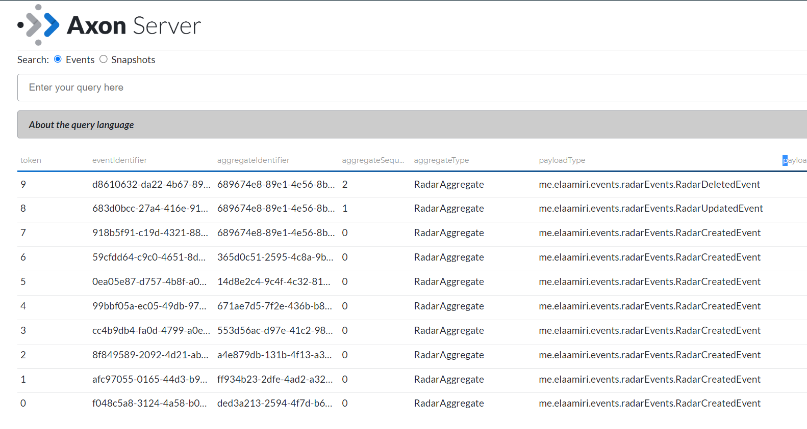
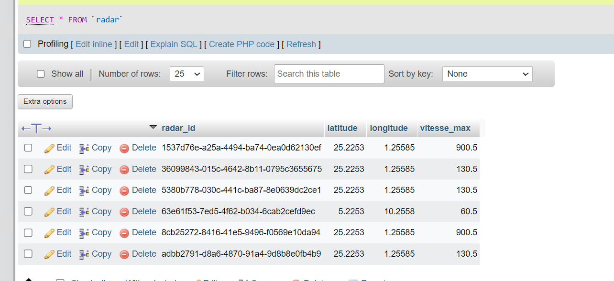

# vehicle-speed-violations-manager

## Project Description

On souhaite créer un système distribué basé sur les micro-services en utilisant une architecture pilotée
par les événements respectant les deux patterns Event Sourcing et CQRS. Cette application devrait
permettre de gérer les infractions concernant des véhicules suites à des dépassement de vitesses
détectés par des radars automatiques. Le système se compose de trois micro-services :


Le micro-service qui permet de gérer les radars. Chaque radar est défini par son id, sa vitesse
maximale, des coordonnées : Longitude et Latitude.


Le micro-service d’immatriculation qui permet de gérer des véhicules appartenant des
propriétaires. Chaque véhicule appartient à un seul propriétaire. Un propriétaire est défini par
son id, son nom, sa date de naissance, son email et son email. Un véhicule est défini par son
id, son numéro de matricule, sa marque, sa puissance fiscale et son modèle.


Le micro-service qui permet de gérer les infractions. Chaque infraction est définie par son id,
sa date, le numéro du radar qui a détecté le dépassement, le matricule du véhicule, la vitesse
du véhicule, la vitesse maximale du radar et le montant de l’infraction.


En plus des opérations classiques de consultation et de modifications de données, le système doit
permettre de poster un dépassement de vitesse qui va se traduire par une infraction. En plus, il doitpermettre à un propriétaire de consulter ses infractions.


L’application est basée sur les Framework Spring Cloud et AXON. Chaque micro-service est découplé
en deux parties indépendantes : la partie commande et la partie Query du micro-service.

En plus des modules représentant les différents micro-services, le projet utilise un module « common-
api » sous forme d’un projet maven qui déclare les composants communs aux différents projets

comme les Commandes, les Evénements, les Queries, les DTOs, etc. Dans ce module, vous pouvez
travailler avec Java ou Kotlin


## Etablir une architecture technique du projet


## Etablir un diagramme de classe global du projet


- Parent project `pom.xml`

<details>

<summary>OPEN DETAILS</summary>

```xml
<?xml version="1.0" encoding="UTF-8"?>
<project xmlns="http://maven.apache.org/POM/4.0.0" xmlns:xsi="http://www.w3.org/2001/XMLSchema-instance"
	xsi:schemaLocation="http://maven.apache.org/POM/4.0.0 https://maven.apache.org/xsd/maven-4.0.0.xsd">
	<modelVersion>4.0.0</modelVersion>
    <packaging>pom</packaging>
    <modules>
        <module>common-api</module>
    </modules>
    <parent>
		<groupId>org.springframework.boot</groupId>
		<artifactId>spring-boot-starter-parent</artifactId>
		<version>2.7.7</version>
		<relativePath/> <!-- lookup parent from repository -->
	</parent>
	<groupId>me.elaamiri</groupId>
	<artifactId>vehicle-speed-violations-manager</artifactId>
	<version>0.0.1-SNAPSHOT</version>
	<name>vehicle-speed-violations-manager</name>
	<description>vehicle speed violations manager based on Event Sourcing and CQRS </description>
	<properties>
		<java.version>11</java.version>
	</properties>
	<dependencies>
		<dependency>
			<groupId>org.springframework.boot</groupId>
			<artifactId>spring-boot-starter-data-jpa</artifactId>
		</dependency>
		<dependency>
			<groupId>org.springframework.boot</groupId>
			<artifactId>spring-boot-starter-web</artifactId>
		</dependency>

		<dependency>
			<groupId>com.mysql</groupId>
			<artifactId>mysql-connector-j</artifactId>
			<scope>runtime</scope>
		</dependency>
		<dependency>
			<groupId>org.projectlombok</groupId>
			<artifactId>lombok</artifactId>
			<optional>true</optional>
		</dependency>
		<dependency>
			<groupId>org.springframework.boot</groupId>
			<artifactId>spring-boot-starter-test</artifactId>
			<scope>test</scope>
		</dependency>

		<dependency>
			<groupId>org.axonframework</groupId>
			<artifactId>axon-spring-boot-starter</artifactId>
			<version>4.6.1</version>
<!--			<exclusions>-->
<!--				<exclusion>-->
<!--					<groupId>org.axonframework</groupId>-->
<!--					<artifactId>axon-server-connector</artifactId>-->
<!--				</exclusion>-->
<!--			</exclusions>-->
		</dependency>
	</dependencies>

	<build>
		<plugins>
			<plugin>
				<groupId>org.springframework.boot</groupId>
				<artifactId>spring-boot-maven-plugin</artifactId>
				<configuration>
					<excludes>
						<exclude>
							<groupId>org.projectlombok</groupId>
							<artifactId>lombok</artifactId>
						</exclude>
					</excludes>
				</configuration>
			</plugin>
		</plugins>
	</build>

</project>

```

</details>

## Développer le micro-service Radar

### Poperties 

```properties
spring.application.name= radar-management-service
server.port= 8081

spring.datasource.url= jdbc:mysql://${MYSQL_HOST:localhost}:${MYSQL_PORT:3306}/radar-management-service?createDatabaseIfNotExist=true
spring.datasource.username=${MYSQL_USERNAME:root}
spring.datasource.password=${MYSQL_PASSWORD:}

spring.jpa.hibernate.ddl-auto=update
spring.jpa.properties.hibernate.dialect= org.hibernate.dialect.MariaDBDialect
```
### Command module

#### Commands

- CreateRadarCommand
```java
package me.elaamiri.commands.radarCommands;

public class CreateRadarCommand extends BaseCommand<String> {

    @Getter
    private double vitesse_max;
    @Getter
    private float longitude;
    @Getter
    private  float latitude;

    public CreateRadarCommand(String commandId, double vitesse_max, float longitude, float latitude) {
        super(commandId);
        this.vitesse_max = vitesse_max;
        this.longitude = longitude;
        this.latitude = latitude;
    }
}

```

- UpdateRadarCommand
```java
package me.elaamiri.commands.radarCommands;

import lombok.Getter;
import me.elaamiri.commands.BaseCommand;

public class UpdateRadarCommand extends BaseCommand<String> {

    @Getter
    private double vitesse_max;
    @Getter
    private float longitude;
    @Getter
    private  float latitude;

    public UpdateRadarCommand(String commandId, double vitesse_max, float longitude, float latitude) {
        super(commandId);
        this.vitesse_max = vitesse_max;
        this.longitude = longitude;
        this.latitude = latitude;
    }
}


```


- DeleteRadarCommand
```java
package me.elaamiri.commands.radarCommands;

import me.elaamiri.commands.BaseCommand;

public class DeleteRadarCommand extends BaseCommand<String> {
    public DeleteRadarCommand(String commandId) {
        super(commandId);
    }
}


```


#### Events 

- RadarCreatedEvent
```java
package me.elaamiri.events.radarEvents;

import lombok.Getter;
import me.elaamiri.events.BaseEvent;

public class RadarCreatedEvent extends BaseEvent<String> {
    @Getter
    private double vitesse_max;
    @Getter
    private float longitude;
    @Getter
    private  float latitude;

    public RadarCreatedEvent(String id, double vitesse_max, float longitude, float latitude) {
        super(id);
        this.vitesse_max = vitesse_max;
        this.longitude = longitude;
        this.latitude = latitude;
    }
}


```

- RadarUpdatedEvent
```java
package me.elaamiri.events.radarEvents;

import lombok.Getter;
import me.elaamiri.events.BaseEvent;

public class RadarUpdatedEvent extends BaseEvent<String> {

    @Getter
    private double vitesse_max;
    @Getter
    private float longitude;
    @Getter
    private  float latitude;

    public RadarUpdatedEvent(String id, double vitesse_max, float longitude, float latitude) {
        super(id);
        this.vitesse_max = vitesse_max;
        this.longitude = longitude;
        this.latitude = latitude;
    }
}


```

- RadarDeletedEvent
```java
package me.elaamiri.events.radarEvents;

import me.elaamiri.events.BaseEvent;

public class RadarDeletedEvent extends BaseEvent<String> {
    public RadarDeletedEvent(String id) {
        super(id);
    }
}


```


#### Dtos

- CreateRadarRequestDTO
```java
package me.elaamiri.dtos.radarDtos;

@Data @AllArgsConstructor @NoArgsConstructor
public class CreateRadarRequestDTO {

    private double vitesse_max;
    private float longitude;
    private  float latitude;
}

```

- UpdateRadarRequestDTO 
```java
package me.elaamiri.dtos.radarDtos;

@Data @AllArgsConstructor @NoArgsConstructor
public class UpdateRadarRequestDTO {
    private double vitesse_max;
    private float longitude;
    private  float latitude;
}


```

#### Aggregate

```java
package me.elaamiri.radarmanagement.command.aggregates;

@Slf4j
@Aggregate
public class RadarAggregate {
    @AggregateIdentifier
    @Getter
    private String radarId;
    @Getter
    private double vitesse_max;
    @Getter
    private float longitude;
    @Getter
    private  float latitude;

    public RadarAggregate() {
    }

    @CommandHandler
    public RadarAggregate(CreateRadarCommand command) {
        // validation
        if(command.getVitesse_max()<0) throw new NegativeSpeedException("Speed can not be negative");
        AggregateLifecycle.apply(new RadarCreatedEvent(
            command.getCommandId(), command.getVitesse_max(), command.getLongitude(), command.getLatitude()
        ));
    }

    @EventSourcingHandler
    public void on(RadarCreatedEvent event){
        this.radarId = event.getId();
        this.vitesse_max = event.getVitesse_max();
        this.longitude = event.getLongitude();
        this.latitude = event.getLatitude();
    }

    @CommandHandler
    public void handle(UpdateRadarCommand command){
        log.info("Enter UpdateRadarCommand");
        // validations
        if(command.getCommandId() == null || command.getCommandId().isBlank()) throw new UnvalidObjectId("ID is not valid.");
        if(command.getVitesse_max()<0) throw new NegativeSpeedException("Speed can not be negative");
        AggregateLifecycle.apply(new RadarUpdatedEvent(
                command.getCommandId(), command.getVitesse_max(), command.getLongitude(), command.getLatitude()
        ));

        /* TODO: validate if the radar exists*/

    }

    @EventSourcingHandler
    public void on(RadarUpdatedEvent event){
        log.info("Enter RadarUpdatedEvent");
        this.radarId = event.getId();
        this.vitesse_max = event.getVitesse_max();
        this.longitude = event.getLongitude();
        this.latitude = event.getLatitude();
    }


    @CommandHandler
    public void handle(DeleteRadarCommand command){
        // validations
        AggregateLifecycle.apply(new RadarDeletedEvent(
                command.getCommandId()
        ));

        /* TODO: validate if the radar exists*/

    }

    @EventSourcingHandler
    public void on(RadarDeletedEvent event){
        log.warn("Deleting Radar: "+ event.getId());
    }

}

```

#### Command Controller

```java
package me.elaamiri.radarmanagement.command.controllers;

@RestController
@AllArgsConstructor
@RequestMapping(path = "/commands/radar")
public class RadarCommandController {
    private CommandGateway commandGateway;

    @PostMapping("/create")
    public CompletableFuture<String> createRadar(@RequestBody CreateRadarRequestDTO createRadarRequestDTO){
        CompletableFuture<String> response = commandGateway.send(new CreateRadarCommand(
                UUID.randomUUID().toString(),
                createRadarRequestDTO.getVitesse_max(),
                createRadarRequestDTO.getLongitude(),
                createRadarRequestDTO.getLatitude()
        ));
        return  response;
    }

    @PutMapping("/update/{radar_id}")
    public CompletableFuture<String> updateRadar(@RequestBody UpdateRadarRequestDTO updateRadarRequestDTO, @PathVariable String radar_id){
        CompletableFuture<String> response = commandGateway.send(new UpdateRadarCommand(
                radar_id, // entered ID
                updateRadarRequestDTO.getVitesse_max(),
                updateRadarRequestDTO.getLongitude(),
                updateRadarRequestDTO.getLatitude()
        ));
        return  response;
    }

    @DeleteMapping("/delete/{radar_id}")
    public CompletableFuture<String> deleteRadar(@PathVariable String radar_id){
        CompletableFuture<String> response = commandGateway.send(new DeleteRadarCommand(
                radar_id// entered ID
        ));
        return  response;
    }


    //@ExceptionHandler(Exception.class)
    public ResponseEntity<String> exceptionHandler(Exception exception){
        ResponseEntity<String> responseEntity = new ResponseEntity<>(
                exception.getMessage(), HttpStatus.INTERNAL_SERVER_ERROR
        );

        return responseEntity;
    }
}

```

#### Tests

- Connected to Axon server


- Events 



- HttpRequest

```http
GET /commands/radar/eventStore/689674e8-89e1-4e56-8b08-7a830d85169e HTTP/1.1
Host: localhost:8081
Content-Type: application/json
Content-Length: 92

{
    
   "vitesse_max": 900.5,
    "longitude": 1.25585,
    "latitude": 25.2253
}


``` 

- response

```res
HTTP/1.1 200 
Content-Type: application/json
Transfer-Encoding: chunked
Date: Sat, 24 Dec 2022 12:34:13 GMT
Connection: close

[
  {
    "type": "RadarAggregate",
    "aggregateIdentifier": "689674e8-89e1-4e56-8b08-7a830d85169e",
    "sequenceNumber": 0,
    "identifier": "918b5f91-c19d-4321-8848-1e6e39aa60d8",
    "timestamp": "2022-12-24T12:18:05.581Z",
    "metaData": {},
    "payload": {
      "id": "689674e8-89e1-4e56-8b08-7a830d85169e",
      "vitesse_max": 300.5,
      "longitude": 1.25585,
      "latitude": 25.2253
    },
    "payloadType": "me.elaamiri.events.radarEvents.RadarCreatedEvent"
  },
  {
    "type": "RadarAggregate",
    "aggregateIdentifier": "689674e8-89e1-4e56-8b08-7a830d85169e",
    "sequenceNumber": 1,
    "identifier": "683d0bcc-27a4-416e-9128-1b9527d71d79",
    "timestamp": "2022-12-24T12:18:16.650Z",
    "metaData": {},
    "payload": {
      "id": "689674e8-89e1-4e56-8b08-7a830d85169e",
      "vitesse_max": 900.5,
      "longitude": 1.25585,
      "latitude": 25.2253
    },
    "payloadType": "me.elaamiri.events.radarEvents.RadarUpdatedEvent"
  },
  {
    "type": "RadarAggregate",
    "aggregateIdentifier": "689674e8-89e1-4e56-8b08-7a830d85169e",
    "sequenceNumber": 2,
    "identifier": "d8610632-da22-4b67-8930-560554f021ec",
    "timestamp": "2022-12-24T12:18:40.710Z",
    "metaData": {},
    "payload": {
      "id": "689674e8-89e1-4e56-8b08-7a830d85169e"
    },
    "payloadType": "me.elaamiri.events.radarEvents.RadarDeletedEvent"
  }
]

```

- **Note**: have to add this 2 @Beans to the application

```java
@Bean // to configure XStream
	public XStream xStream() {
		XStream xStream = new XStream();

		xStream.allowTypesByWildcard(new String[] { "me.elaamiri.**" });
		return xStream;
	}

@Bean // for axon server connection
    CommandBus commandBus(){
        return SimpleCommandBus.builder().build();
    }

```

- `pom.xml`

<details>
<summary>OPEN DETAILS</summary>

```xml
<?xml version="1.0" encoding="UTF-8"?>
<project xmlns="http://maven.apache.org/POM/4.0.0" xmlns:xsi="http://www.w3.org/2001/XMLSchema-instance"
         xsi:schemaLocation="http://maven.apache.org/POM/4.0.0 https://maven.apache.org/xsd/maven-4.0.0.xsd">
    <modelVersion>4.0.0</modelVersion>
    <parent>
        <artifactId>vehicle-speed-violations-manager</artifactId>
        <groupId>me.elaamiri</groupId>
        <version>0.0.1-SNAPSHOT</version>
    </parent>
    <groupId>me.elaamiri</groupId>
    <artifactId>radar-management</artifactId>
    <version>0.0.1-SNAPSHOT</version>
    <name>radar-management</name>
    <description>radar-management</description>
    <properties>
        <java.version>11</java.version>
    </properties>
    <dependencies>
        <dependency>
            <groupId>org.springframework.boot</groupId>
            <artifactId>spring-boot-starter</artifactId>
        </dependency>

        <dependency>
            <groupId>org.springframework.boot</groupId>
            <artifactId>spring-boot-starter-test</artifactId>
            <scope>test</scope>
        </dependency>

        <dependency>
            <groupId>me.elaamiri</groupId>
            <artifactId>common-api</artifactId>
            <version>0.0.1-SNAPSHOT</version>
        </dependency>
        <dependency>
            <groupId>me.elaamiri</groupId>
            <artifactId>common-api</artifactId>
            <version>0.0.1-SNAPSHOT</version>
            <scope>compile</scope>
        </dependency>

    </dependencies>

    <build>
        <plugins>
            <plugin>
                <groupId>org.springframework.boot</groupId>
                <artifactId>spring-boot-maven-plugin</artifactId>
            </plugin>
        </plugins>
    </build>

</project>

```

</details>


### Query module

#### Entities 

``` java
package me.elaamiri.radarmanagement.query.entities;

import javax.persistence.Entity;
import javax.persistence.Id;

@Entity
@Data @NoArgsConstructor @AllArgsConstructor
public class Radar {

    @Id
    private String radarId;
    private double vitesse_max;
    private float longitude;
    private  float latitude;
}

```

#### Repositories

```java
package me.elaamiri.radarmanagement.query.repositories;

public interface RadarRepository extends JpaRepository<Radar, String> {

}

```

#### Queries 

- GetAllRadarsQuery

```java
package me.elaamiri.queries.radarQueries;

public class GetAllRadarsQuery {
}

```

- GetRadarByIdQuery

```java
package me.elaamiri.queries.radarQueries;

import lombok.Getter;

public class GetRadarByIdQuery {
    @Getter
    private String radarId;

    public GetRadarByIdQuery(String radarId) {
        this.radarId = radarId;
    }
}

```

#### Services and Queryhandlers

- RadarEventHandlerService

```java
package me.elaamiri.radarmanagement.query.services;
@Service
@Slf4j
@AllArgsConstructor @NoArgsConstructor
public class RadarEventHandlerService {

    @Autowired
    private  RadarRepository radarRepository;

    @EventHandler
    public void on(RadarCreatedEvent event){
        log.info("#==> RadarCreatedEvent Received");
        Radar radar = Radar.builder()
                .radarId(event.getId())
                .vitesse_max(event.getVitesse_max())
                .longitude(event.getLongitude())
                .latitude(event.getLatitude())
                .build();
        System.out.println(radar);

        Radar savedRadar = radarRepository.save(radar);
        log.info("#==> Radar saved");
    }

    @EventHandler
    public void on(RadarUpdatedEvent event){
        log.info("#==> RadarUpdatedEvent Received");
        Radar radar = radarRepository.findById(event.getId()).orElseThrow(()-> new RadarNotFoundException(String.format("Radar with ID [%s] Not Found !", event.getId())));
        radar.setVitesse_max(event.getVitesse_max());
        radar.setLongitude(event.getLongitude());
        radar.setLatitude(event.getLatitude());

        radarRepository.save(radar);
    }

    @EventHandler
    public void on(RadarDeletedEvent event){
        log.info("RadarDeletedEvent Received");
        Radar radar = radarRepository.findById(event.getId()).orElseThrow(()-> new RadarNotFoundException(String.format("Radar with ID [%s] Not Found !", event.getId())));
        radarRepository.deleteById(radar.getRadarId());
    }
}

```

- RadarQueryHandlerService

```java
package me.elaamiri.radarmanagement.query.services;
import java.util.List;

@Service
@Slf4j
@AllArgsConstructor
@NoArgsConstructor
public class RadarQueryHandlerService {
    @Autowired
    private RadarRepository radarRepository;

    @QueryHandler
    public List<Radar> on(GetAllRadarsQuery query){
        return radarRepository.findAll();
    }

    @QueryHandler
    public Radar on(GetRadarByIdQuery query){
        return radarRepository.findById(query.getRadarId()).orElseThrow(()-> new RadarNotFoundException(String.format("Radar with ID [%s] not found.", query.getRadarId())));
    }
}

```

#### Query Controller

```java
package me.elaamiri.radarmanagement.query.controllers;

import java.util.List;

@RestController
@AllArgsConstructor @NoArgsConstructor
@RequestMapping("/query/radars")
public class RadarQueryController {
    @Autowired
    private QueryGateway queryGateway;

    @GetMapping("")
    public List<Radar> getAllRadars(){
        List<Radar> radars = queryGateway.query(new GetAllRadarsQuery(), ResponseTypes.multipleInstancesOf(Radar.class)).join();
        return  radars;
    }

    @GetMapping("/{radar_id}")
    public Radar getRadarById(@PathVariable String radar_id){
        Radar radar = queryGateway.query(new GetRadarByIdQuery(radar_id), ResponseTypes.instanceOf(Radar.class)).join();
        return  radar;
    }

    //@ExceptionHandler(Exception.class)
    public ResponseEntity<String> exceptionHandler(Exception exception){
        ResponseEntity<String> responseEntity = new ResponseEntity<>(
                exception.getMessage(), HttpStatus.INTERNAL_SERVER_ERROR
        );

        return responseEntity;
    }
}

```

#### Test 

- Adding radar 

```http
POST /commands/radar/create HTTP/1.1
Host: localhost:8081
Content-Type: application/json
Content-Length: 91

{
    
   "vitesse_max": 640.5,
    "longitude": 180.25585,
    "latitude": 58.2253
}

---- RES

HTTP/1.1 200 
Content-Type: text/plain;charset=UTF-8
Content-Length: 36
Date: Sat, 24 Dec 2022 14:11:22 GMT
Connection: close

8cb25272-8416-41e5-9496-f0569e10da94

```

- Show all Radars

```http
GET /query/radars HTTP/1.1
Host: localhost:8081
```
<details>
<summary>OPEN Details</summary>

```json
HTTP/1.1 200 
Content-Type: application/json
Transfer-Encoding: chunked
Date: Sat, 24 Dec 2022 14:13:02 GMT
Connection: close

[
  {
    "radarId": "1537d76e-a25a-4494-ba74-0ea0d62130ef",
    "vitesse_max": 900.5,
    "longitude": 1.25585,
    "latitude": 25.2253
  },
  {
    "radarId": "36099843-015c-4642-8b11-0795c3655675",
    "vitesse_max": 130.5,
    "longitude": 1.25585,
    "latitude": 25.2253
  },
  {
    "radarId": "5380b778-030c-441c-ba87-8e0639dc2ce1",
    "vitesse_max": 130.5,
    "longitude": 1.25585,
    "latitude": 25.2253
  },
  {
    "radarId": "63e61f53-7ed5-4f62-b034-6cab2cefd9ec",
    "vitesse_max": 60.5,
    "longitude": 10.2558,
    "latitude": 5.2253
  },
  {
    "radarId": "8cb25272-8416-41e5-9496-f0569e10da94",
    "vitesse_max": 640.5,
    "longitude": 180.256,
    "latitude": 58.2253
  },
  {
    "radarId": "adbb2791-d8a6-4870-91a4-9d8b8e0fb4b9",
    "vitesse_max": 130.5,
    "longitude": 1.25585,
    "latitude": 25.2253
  }
]

```

</details>

- Show radar: 8cb25272-8416-41e5-9496-f0569e10da94

```http
GET /query/radars/8cb25272-8416-41e5-9496-f0569e10da94 HTTP/1.1
Host: localhost:8081

```

```json
HTTP/1.1 200 
Content-Type: application/json
Transfer-Encoding: chunked
Date: Sat, 24 Dec 2022 14:14:35 GMT
Connection: close

{
  "radarId": "8cb25272-8416-41e5-9496-f0569e10da94",
  "vitesse_max": 640.5,
  "longitude": 180.256,
  "latitude": 58.2253
}

```

- Update it 

```http
PUT /commands/radar/update/8cb25272-8416-41e5-9496-f0569e10da94 HTTP/1.1
Host: localhost:8081
Content-Type: application/json
Content-Length: 92

{
    
   "vitesse_max": 900.5,
    "longitude": 1.25585,
    "latitude": 25.2253
}

```
- Result 

```json
HTTP/1.1 200 
Content-Type: application/json
Transfer-Encoding: chunked
Date: Sat, 24 Dec 2022 14:15:59 GMT
Connection: close

{
  "radarId": "8cb25272-8416-41e5-9496-f0569e10da94",
  "vitesse_max": 900.5,
  "longitude": 1.25585,
  "latitude": 25.2253
}

```

- Database 




## Développer le micro-service Immatriculation

### Command module
### Query module


## Développer le micro-service Infractions

### Command module
### Query module


## Mettre en place les services techniques de l’architecture micro-service (Gateway, Eureka Discovery service)


## Développer votre application Frontend avec Angular ou React


## Sécuriser votre système avec un système de d’authentification OAuth2 comme Keycloak


## Ecrire un script docker-compose.yml pour le déploiement de ce système distribué dans des conteneurs docker.

